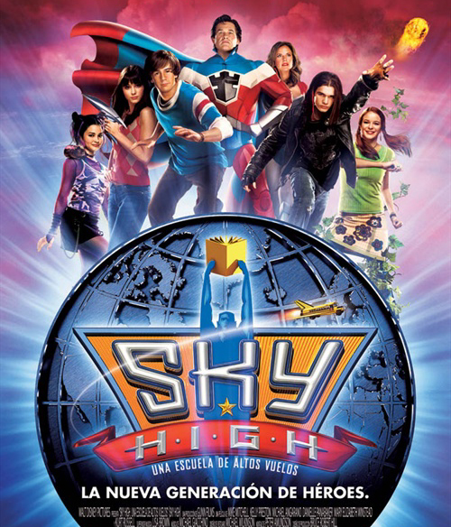

《超人高校Sky High》

			

 

 老公的评论：

　　这是一部很轻松的电影，而且和漫画英雄有关系，如果不看出品年份的话，我几乎怀疑这是一部新电影了。

 

　　美国人的主张一贯是这个世界一向是有超人的，外星人住在51区，而漫画英雄们住在52区，超人是他们的老大，至于53区目前还在探索之中，如果有的话，很有可能居住在那里的就是变形金刚。不过这些都是为英雄们准备的，英雄的孩子们？

 

　　在这部电影之中给了我们关于漫画英雄孩子们的答案，他们都要去上超人高中，不幸的是，有些超人的孩子并没有超能力，或者是那些超能力都是看起来微不足道的，他们又要怎样适应周围的同学和环境呢？据说上一个父母都是超人的孩子因为并没有超能力而成为了校车的司机，如今我们的主人公又遭遇了相同的境地……

 

　　感觉上这部电影是后来一些剧集的前言，比如《迷幻学院》，就是在一个封闭的校园之内集合了很多超能少年，可惜被砍了！

 

　　轻松、简单、喜剧，不妨看看！

 

老婆的评论：

 

　　其实我没想到这部影片是2005年的，在看影片时，总觉的高校老师Coach（布鲁斯·坎贝尔饰）是我们看过的《火线警告》里的Sam，又觉的不是，老公还觉的有可能是sam的兄弟之类的，因为很年轻又帅一些。当然，现在我确定是同一演员！

 

　　哦，看的欧美影片越多，眼熟的人越多，会召唤植物的Layla原来和《律政狂鲨》的Julie是同一个演员。

 

　　这部影片整体来说还是很轻松。是一堆有超能力的孩子们在超人高中发生的一系列事件。will是最厉害超人夫妻的孩子，本以为他应该是最厉害，但will在刚去超人学校时，他什么能力都没有显现出来，被分配到超人助理班了。

 

　　will被女学长吸引，忽视了他最好的朋友Layla的感情，然而女学长所做的一切是有目的。还好最终will想明白了与女学长分开了，与Layla在一起，这让我比较高兴。
 
上映年份：2005年							
		
http://blog.sina.com.cn/s/blog_52187ba90100y5lb.html
