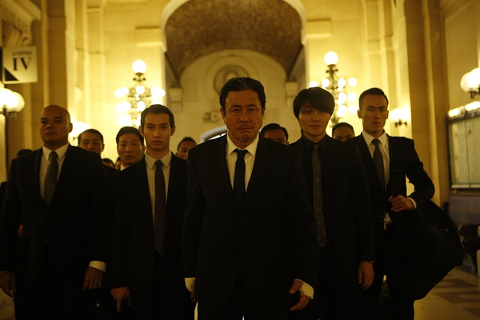

《超体 Lucy》

			

 
老公的评论：
 
　　这是我迄今看过最好的科幻电影，是最好，没有之一。
 

　　时至今日，几乎一切都是靠特效，我说的不止是电影，连人的长相都是靠特效，科幻已经失去了很多“科幻”的内涵。科幻题材的电影电视剧越拍越多，已经失去了科幻本应让人们最惊叹的“创新的”感觉。
 

　　其实，我一直认为科幻影视最重要的一点，就是把科幻的题材用视觉效果表现出来的“还原感”，我这代人，最早接触科幻还是科幻小说的，所以科幻的概念在我的脑袋里早就有了一个基本的概念，所以每当面对科幻影视的时候，总是会和自己脑中想象出的场景比较，想象总是完美的，能够比得上想象的科幻影视实在是太少了，能够完全吻合的就没有了，这部《超体》就是。
 

　　如今的科幻越来越喜欢拍“大场面”，事实上探讨地球和人类本身的题材越来越少，我一直记得同学董宁董二爷的一句话“等到人们了解了人脑的构造了，才能造出人脑一样的电脑”，人们现在不是造不出真正的人工智能，而是不了解自己的大脑。
 
　　对于这部电影而言，就是要把我们的大脑的力量完全表现出来，就这样。
 
　　另外，我觉得我是15%的人。

 
老婆的评论：
 

　　有没有觉得这部电影非常的酷？我觉得太酷了，第一是女主人公露西坐着轮椅穿越各个时间线，多让人震撼。第二是她在战斗中表现的，手指一挥到下一片，让我很兴奋。第三是露西最后无处不在的感觉，太酷了。
 

　　刚开始的时候觉得这部电影很生活化，露西被男友骗去送东西，与对方张先生那段时间，还有不同的其他镜头，有大猩猩有科学家演讲，很碎片化，真不知道要演什么，一切精彩的演出要在毒品释放在露西体内，随着她的脑进化程度，都变得不一样了。
 
　　好好花时间看看这部电影吧，我想我不太能讲明白我看这部电影的感觉。

酷吧，随便动动手指头，那些人就被吊在房顶，看来有必要开发一下脑瓜子额！

一群打酱油的黑社会
上映年份　2014							
		
http://blog.sina.com.cn/s/blog_52187ba90102vcif.html
