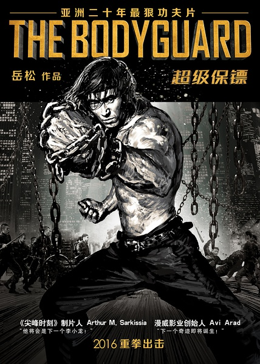
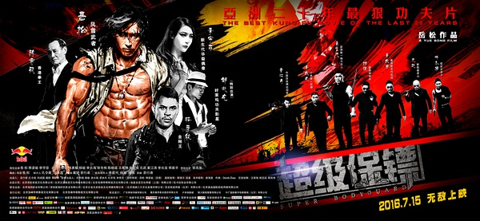
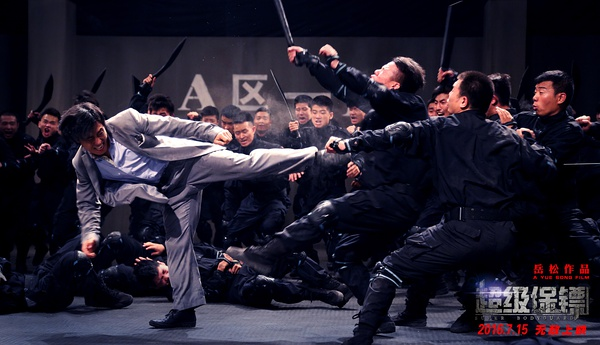

《超级保镖》

			

老公的评论：

　　看这部电影很有一些看“老功夫片”的感觉——虽然也许剧情没有什么“侠之大者为家为国”的场面，但是整体来说，《超级保镖》的剧情故事完整，剪辑上没有拖沓，看动作片，看的就是打斗。

　　作为一名观众，其实我并不是很介意电影拍摄的时候是否用了替身，是否加了后期特效，毕竟我只能通过我的眼睛看到播放到银幕的内容，只要别让我看出穿帮的镜头，拍摄的技巧、制作的手法其实我是看不出来的，所以，评论我看过的电影的时候，我也更愿意谈我看到的东西。

　　据说本片的导演、主演岳松想要再创中国功夫片的辉煌，我认为至少在这部《超级保镖》中我看到这种可能性。对一部发生在现在故事背景下的功夫片，能够做到像《超级保镖》这样：有传说、有门派，有武侠精神，有善恶、有恩仇……，足够了。

　　电影在爱情方面并没有落入俗套，没有一定让保镖和大小姐发生一段爱情故事，这点让电影看着简单，不错。

　　从建设的角度而言，我认为这部电影的瑕疵在于：反派明知道武功不一定是男主角的对手，为什么不用枪呢？我认为整个剧情并没有很好地解释这一问题。对于一部功夫片，如果一切都能够找到一个合理限制枪支使用的理由，就太完美了。

　　希望岳松的梦想能够实现，希望中国功夫片能够在全球电影市场依旧占据一片江山！

老婆的评论：

　　我看这部电影在剧情上的安排极其简单，打、打、再打，主人公真的很扛，不过，还从头到尾保持了一个诉求点，那就是铁腿门选择了保护一人，非常的忠诚。

　　功夫小子“武林”（岳松饰）在师兄的李江（释彦能饰）安排下成为冷城首富千金李菲菲（李宇菲饰）的保镖，而最后这份工作又与李江有了冲突，如何抉择？被活埋也要发扬其铁腿门的宗旨，那就是武林的选择。

　　有的时候，我非常的不能和编剧的思维在同一个频道，比如，武林闯进保镖基地，既然双方已是敌对的关系，为什么不早开几枪呢？还有保镖集团那么多的人，车轮战先消耗其体力等，居然让武林赢了，难道只因为武林是主人公，他代表的是正义方？！还是因为他大难不死必要后福呢！

　　在我看来，战争从来是由绝对实力决定胜败的，好吧，我们就想成那其实就是中国版的孤胆英雄。

上映年份：2016							
		
http://blog.sina.com.cn/s/blog_52187ba90102x0ny.html
