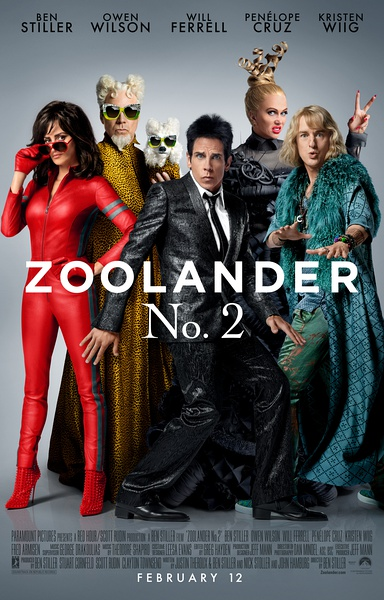
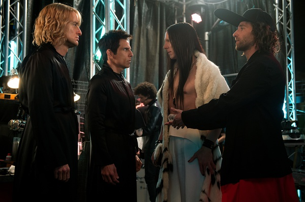

《超级名模 2 Zoolander 2》

			

老公的评论：

　　本·斯蒂勒在《热带惊雷》中给我留下的感觉还是很不错的，而欧文·威尔逊则是从《上海正午》开始就给我留下了深刻的印象，但是，我最终发现，有些怀旧只能怀旧，不能代替现实。

　　实话实说，这部电影是为数不多的我知道演员们每一句话想表达的意思，却不知道整部电影在演什么的文艺作品。

　　为什么要拍这样一部电影呢？当然，是在看过之后我才发现原来不止我们，《超级名模
2》在哪里都是恶评如潮……，也真难为斯蒂勒了。

　　在观看过程中，我的想法只有一个：时代在进步，而这些老演员们却在原地踏步。斯蒂勒在片中把自己化妆的很年轻，但是他却已经无法回到年轻时的辉煌了。

　　这部片子中有大量的明星客串，算是一个小卖点吧。另外威尔·法瑞尔在这部片子了怎么看着那么像隆·佩尔曼……

　　有的时候，情怀只能留给回忆，我想，我慢慢地会放弃这些过气明星了……

老婆的评论：

　　其实看完后，我想了又想，最后的结论就是我没看懂这部电影，甚至，我一点都不知道这部电影在讲什么。

　　通常这种情况，我把这一现象归结于，这部电影要表达的是一种我不理解的文化，或者是一种信仰。

　　再或者，电影的编剧并没有这么多想法，他只想拍一部在架空的世界观下搞搞无厘头的电影，搞笑搞笑，那么我体会到其中的无厘头，没有体会到搞笑。

　　最重要的是，这样一部电影把我有催眠作用，还没怎么的，我好几次都要睡着了。

　　那么关于电影的剧情，其实我也没什么要说的，在我看来，这部电影像是各种片段组成的没有一个完整的架构，大概是因为这部电影不是我的菜，所以我挑剔了。

　　不过，要说回来，这部电影里客串的明星到是挺多的。

上映年份：2016
							
		
http://blog.sina.com.cn/s/blog_52187ba90102x0ug.html
