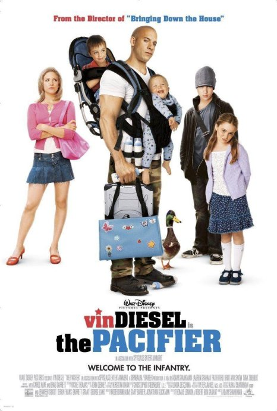
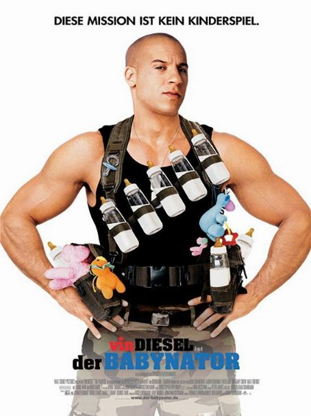

《超级奶爸The Pacifier》

			

老公的评论：

　　范·迪塞尔主演的一部动作喜剧，很好看，但是因为是2005年的，现在看起来有一些地方显得有些做作，不过整体来说没问题，范·迪塞尔虽然也是一个超级动作巨星，但他的表演很质朴。
 

　　看过这部电影，我要说的更多不是电影本身，而是我在看电影的时候关于人的记忆的一些感觉。其实找这部电影来看是因为看《速度与激情》系列觉得范·迪塞尔的片子应该差不了，但是在网上找到的时候，我就已经觉得这部电影看过了。但是不知道为什么，电影的开始，就是海豹突击队那段并没有给我留下什么深刻的印象，因此虽然越往下看熟悉的桥段越多，我依旧觉得是一种错觉。看到最后主人公唱着儿歌过险关的时候，我确定我看过这部电影了，但是不知道为什么，没有记住。
 

　　我觉得没有记住的重要原因，是我之前看这部电影的时候并不认识范·迪塞尔，我不知道看到这篇文章的朋友是否也有相同的感觉，同样一部电影，如果是我们熟悉的演员出演的，我们的记忆就会保留很久很久，但如果出演的演员我们之前并不认识，那么很可能过了很久我们觉得这部片子好像没有看过，这到底是记忆再和我们开的什么玩笑呢？
 

　　抛开电影，生活也是如此，比如踢球、打球，如果并没有特殊的事件发生，我们总是更容易和熟悉的人一起做过的事情，但记忆应该是公平的啊，到底是我们把那些不熟悉的人真的忘了，还是那些人和那些事情躲在了我们记忆的深处……
 

　　想到了很多很多，比如有些事情我们本来已经完全忘记了，但是大脑会帮助我们把残缺的部分按照我们的意愿补足，又比如忘记了很久的事情会被突然想起来……

 

 
老婆的评论：
 

　　刚刚把范·迪塞尔主演的《速度与激情》系列看完，老公又给找来了这样一部影片，虽然年代久远一些，但影片的轻松喜剧色彩再配上范·迪塞尔的一些动作，感觉上还不错。
 
　　其实挺佩服这美国科学家的，生了5个孩子，真是难得。本片就以海豹特遣队的谢恩·乌尔夫保护这5个孩子并寻找幽灵程式。
 

　　对于一个只会在部队完成任务的谢恩来说，照顾这五个完全没纪律的小朋友实在是太头大，最好玩的是他给他们起名“红老大，红老二……红姥姥”，随着科学家的太太不断的推迟回家的时间，这一过程中，谢恩与小朋友们建立起真正的互动，而他就成了名副其实的“超级奶爸”，也顺利的完成任务。
 
　　谢恩的长官是坏蛋，这点有点意外。谢恩最后还与红老大……的校长建立的恋爱关系，看来他不回部队了，是一种不错的故事结尾。
上映年份：2005年							
		
http://blog.sina.com.cn/s/blog_52187ba90100yf8g.html
