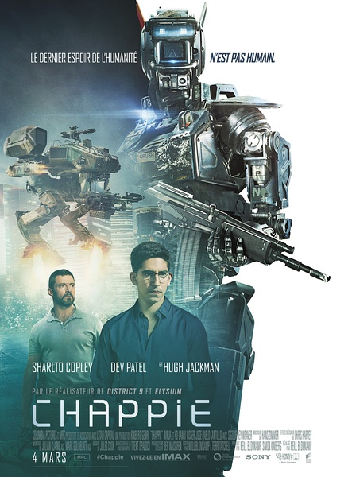
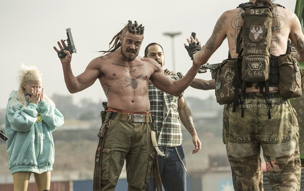
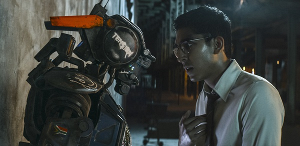
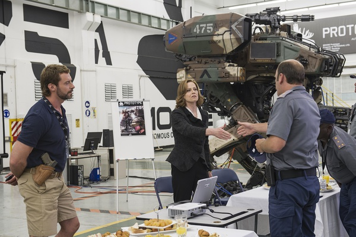

《超能查派 Chappie》

			

老公的评论：

　　按照电影中的发音，这部电影应该翻译成《超能查比》才对，不知道片名又是哪位大神译的……

　　让我觉得这部电影不错的地方，是它的结尾并没有落入俗套，比如让查比死掉或者让制造者死掉……，我一直认为不靠主角死亡博人眼泪的电影境界总是要高一点，这种感觉就像——真正的悲剧可能是用喜剧的形式来表现的。

　　其实这部电影只是借助“人的意识是否可以移植”这一个概念，这个概念本身并不算是新题材了，但是电影的表现手法还算新颖，可惜的是“金刚狼”在这部电影中只是一个可有可无的配角，他的魅力并没有丝毫的发挥……

　　如果人的意识可以可以移植……，听说爱因斯坦的大脑一直被保存着，但是我们真的能够破译人类自身的密码吗？联想到最近一种抗衰老药物正式进入试验阶段——人类对于自身的了解实在太少了——我一直坚信这是限制人们探索人工智能的关键点，什么时候人类把自己研究透彻了，再谈怎么造智能机器人吧！

　　看到电影的结尾，非常想知道未来这几个智能机器人如何生存……，应该是另一部有趣的科幻片儿了吧！

老婆的评论：

　　我喜欢这部电影，更喜欢这个可以有自己思维的机器人查比。当然，结尾部分，我觉得可以更好，或者说这个结局让我不太满意。

　　为什么会对坏人给予这么多的同情呢？最后还让她重生，我真觉得没有必要的，做坏事应得到惩罚，这个道理应该适用于全世界的。

　　我很高兴查比没有死，他比意识转移到另一个机器人身上，我也很高兴那个迪恩他的意识也转移到一个机器人身上，不然查比的未来还真让人担心。也因为迪恩没做错什么。

　　我很讨厌文森特（休·杰克曼饰）这个角色，那是一个非常变态的人，他为了让警方使用他发明的机器人，就做了很多的事，最重要的事，他为了杀戮而杀戮。其实他的机器人完全可以派到战场上去的啊。

　　有点期待未来的人工智能。

　　是一部值得一看的电影。

戴夫·帕特尔

上映年份　2015							
		
http://blog.sina.com.cn/s/blog_52187ba90102w8ay.html
