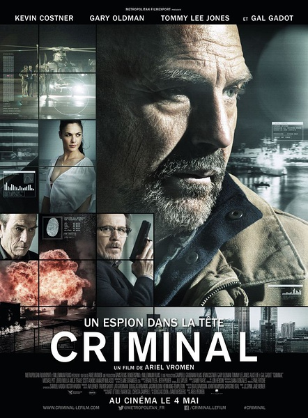
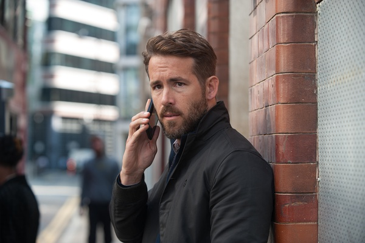

《超脑48小时 Criminal》

			
老公的评论：

　　首先质疑一下这部电影的名字的翻译工作，整部电影和“超脑”没有什么关联吧，而“48小时”的时间也并没有成为故事的一个主线，这种翻译很不准确啊！

　　其实这部电影的创意还是挺不错的，虽然在开始采用了科幻的手法，把一个人的记忆植入另一个人，但是故事的主要情节并不是以科幻为主线，而是讲的人性的转变。个人觉得电影在开头做手术的情节占的篇幅比较大，因为谁都知道这个手术必须做成，所以手术中各种紧张的场景其实并没有什么意义。

　　在观看电影的时候，我一直没有弄懂的是在48小时之后会消失的记忆是罪犯的还是特工的，而且谈了几次都没有弄清楚，这算是一个悬疑点吧，直到故事的最后，才揭露了消失的是罪犯的记忆，挺不错的，不但一个罪犯被改变成了一个好人，还成为了一名特工……

　　最近看了不少“老人家”们主演的电影，我觉得为什么不能用些年轻的演员来主演呢？比如在这部电影里出现过的瑞安·雷诺兹或者斯科特·阿特金斯……，他们都可以出演主人公啊？真实搞不懂，难道西方的电影圈也论资排辈？

　　我总觉得娱乐圈的明星们到了一个时间段就该选择退休了，算是爱惜羽毛吧，看着当年的偶像们一个个还在挣扎，觉得很残酷，很凄凉……

老婆的评论：

　　怎么说呢，这部电影看到最后，我挺感动的，那个极度危险且无法预测的罪犯杰里科·斯图尔特（凯文·科斯特纳饰）在弗兰克斯博士（汤米·李·琼斯）的协助下，接受了CIA探员比利·波普（瑞恩·雷诺兹饰）意外身亡后其记忆与技能，后来能冒险去救比利的妻女，他就不一样了。

　　杰里科从CIA警员手中逃脱时的凶狠给我很深的印象，我想这人在监狱中被人拿铁链拴着是有些道理的。

　　杰里科受脑海里时不时涌现出比利的记忆片段影响，他去了比利家，见到了比利的妻子和女儿，他自然的亲近，很清楚的表达，不会伤害她们。

　　其实，我没想到的是，这部电影是让两个人的记忆共存了，我刚开始的时候，只以为比利的记忆要替代杰里科的记忆，而杰里科明显的能区分那是比利的记忆。

　　这部电影的CIA领导为他的不守诺，导致事情有了波折。而对头黑客技术实在是太高，好像什么都在他的控制下，只是人心那个东西的确与多高的高科技还是不同的。

　　在我看来，这部电影是不错的，最后能导弹能直接把代表邪恶的一方打下来，我是很高兴的。

上映年份：2016							
		
http://blog.sina.com.cn/s/blog_52187ba90102x0zt.html
