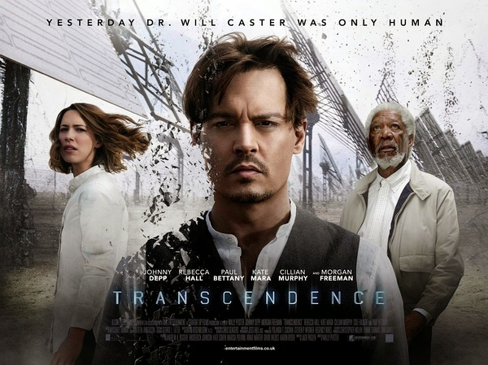

《超验骇客 Transcendence》

			

老公的评论：

　　这是一部科幻电影，讲的是人工智能发展的一个极端现象，可惜并不是我所喜欢的科幻调调。

　　其实有一个环节我一直没有闹懂，那就是Will到底为什么要把计算机发展到那种境界呢？为了爱情的话，他重生了自己就已经可以结束了？为什么非要等到他的妻子用鲜血来换取地球回到原来的样子呢？

　　因为我更喜欢看连续剧，所以我觉得这个电影又是一个比较好的连续剧题材，从某种程度上，这部片子里的人工智能创造了另一个“僵尸世界”，这不是现在最火的题材吗？

　　对了，有趣的现象，最近我们看了《超体》、《透过虫洞看宇宙》，发现怎么都有弗里曼这个老人家？真厉害，真希望能够在自己喜欢的专业领域达到他的高度。

　　也许这不电影是某种科幻的开始，但是我个人觉得对于约翰尼·德普来说，并不是一部成功的作品。

老婆的评论：

　　看这部电影的感觉，让我想起《鹰眼》，这台叫鹰眼的超级计算机想要当主宰者。

　　威尔是PINN这台超级计算机的发明者，在一次演讲中他遭到激进组织的枪击放射性导致他只有很短的寿命了，他的妻子兼研究伙伴伊芙琳想要留住威尔，于是和马克斯把威尔的意识放进了超级计算机PINN中，最后威尔不停地进化，事情好像变得越来越神奇……

　　也是那个天才的脑袋在不敏不休的进化，改变未来的世界的事情不是不可能啊，威尔可以控制金融，可以通过纳米计算控制人类，当然，他的技术已经非常的像外星科技了，身体有缺陷的人都会接受他的治疗的。

　　人真的很矛盾，伊芙琳想要留住威尔，而现在威尔通过纳米计算重生了，她又要毁了他，只不过因为他的太强了？！马克斯被激进组织抓去了，结果变成激进组织的一员。

　　想想威尔好像是那个被动选择的，为了爱他进化，最后为了爱又选择自毁，谁说那超级计算机不是威尔呢？

　　最后，我想说，这部电影只能算将将过及格线吧，因为从科幻的角度来说，他不算创新，从爱情故事来说男女主人公的爱不够打动人心。

　　在某种时候，我认为，科学的进步也许是件好事但最终会导致地球的毁灭。科学违反了自然生命的优胜劣汰本质，也让地球的负担越来越沉重……。

最近的电影怎么都有摩根·弗里曼？

这两人看着眼熟，就不记得看过他们演过什么了，哎，需要一个超脑袋。

上映年份 2014							
		
http://blog.sina.com.cn/s/blog_52187ba90102vcxo.html
