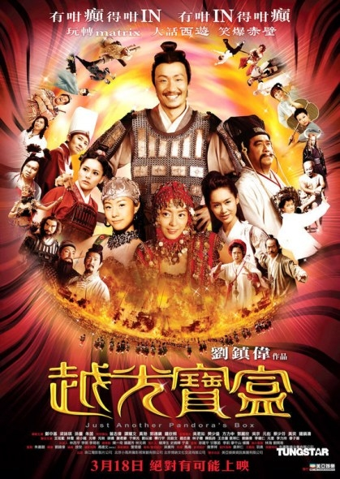

《越光宝盒》

			【夫妻影评】《越光宝盒》

老公的评论：
 
　　刘镇伟曾经是个我喜欢的导演，但他正在用他的新片折磨着我的耐心。
 

　　郑中基，曾经是我认为继梁朝伟、周星驰、张家辉之后最出色的无厘头演员，但参演这样一部电影，让我在犹豫以后还会不会这么喜欢他扮演的角色……
 
　　郭德纲，不喜欢听他的相声，更不喜欢看他演的电影，看到了他，只是因为我不知道这部电影有他出演。
 
　　这部电影留给我的印象，是朱茵没什么变化，依旧明艳照人，而那首主题歌也不错，很上口，很好听。
 
　　不看想看，看了后悔，说的大概就是《越光宝盒》吧。

老婆的评论：
 

　　电影越看越多，但是有内涵的影片却越来越少，现在的什么都讲快餐式，吃饭如此，文化如此，电影更是如此，这部电影也是如此。在看的时候，哈哈一乐，过后你将再也想不起拉。
 

　　不知道什么时候开始，一部电影中总有不少的桥段从别的影片中抄过来一演完事，我不是很喜欢这样的片段，这与抄袭文章区别并不大，这种文化不认同，再经典的东西都被他们弄得失去味道。
 
　　这部影片也是云集了大陆和香港的大牌演员，连好久没看见的唐文龙、谢君豪也在该片中露了一脸，不过真没认出来是唐文龙。
 

　　这部电影还有一个不太喜欢的地方，就是恶搞了三国，把这些人物弄的乱七八糟的，很是讨厌。居然说关羽红脸是因为老看黄色小说，哎！！
 

　　本来很期待这部影片的，以为还有《月光宝盒》的风采，以为有所不同，结果是另人失望的。虽然看电影的时候，我也被恶搞的言语逗乐过，心理还是有无限的遗憾——现在的编剧真的不怎么的。
 
上映年份 2010							
		
http://blog.sina.com.cn/s/blog_52187ba90100hy8s.html
