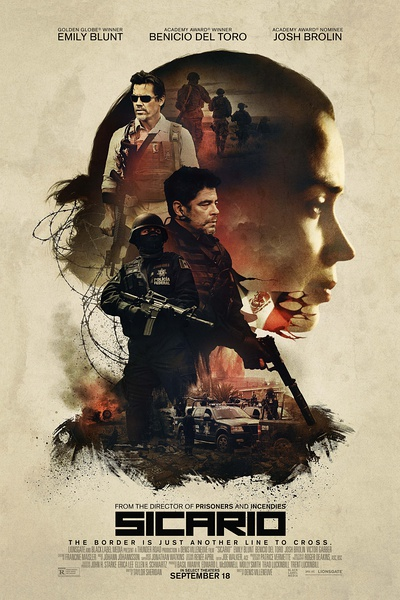
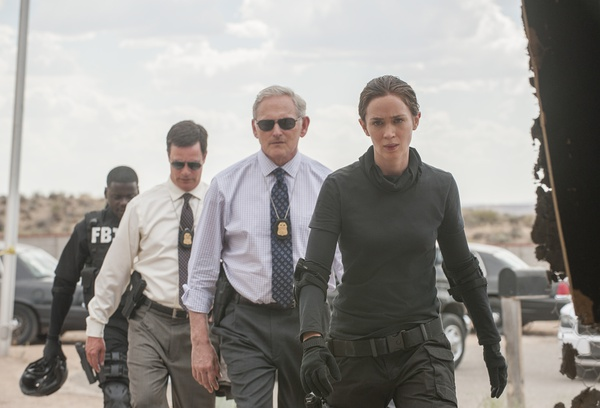
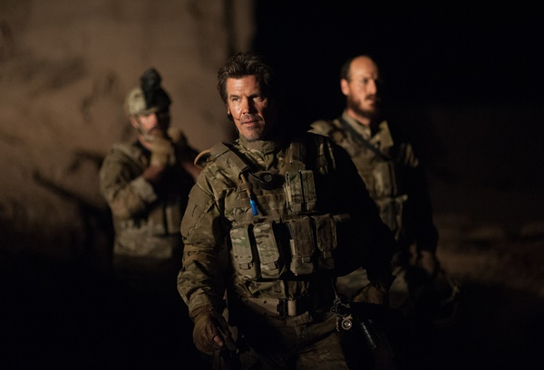

《边境杀手 Sicario》

			

老公的评论：

　　看完片子的第一感觉是这部电影想表现的是一个没有公义的世界。

　　从个人喜好的角度来说，我是非常爱看“以暴制暴”的电影的，但我觉得《边境杀手》想表现的并不是简单的“以暴制暴”，那个女FBI最后的悲伤以及她在整部电影中的无奈就说明了这一切。

　　这部电影的悬念还有点意思，我一直在好奇他们为什么要带着这个女FBI，并且想看看他们最后会怎么毒枭，但是从整体节奏来说，这部电影是很慢的，而且很多桥段有些莫名其妙。

　　通常，我们觉得不好看的电影是不会看完的，这部电影能够被我们看完，我总结除了上面说的悬念设计还可以之外，电影的开头很震撼也算是另一个吸引人的地方吧。我一直觉得，一部好的电影应当是从头到尾都吸引人的，而不是那种越来越深入的剧情，那种最后才把高潮推出的电影，很可能在大家还没有看到一半的时候就放弃了。

　　对了，女FBI的扮演者艾米莉·布朗特曾经在《明日边缘》中出演女主角，不过这次的感觉可真是不太好看！

老婆的评论：

　　这部电影是我看完觉得非常奇怪的电影。可能是因为不太好看，感觉上怎么这么长时间。

　　我一直觉得这个行动小组把凯特调过来后，凯特（艾米莉·布朗特饰）在这个组里显得可有可无，就连她自己去银行调查钱的动向，他们领导都没允许，可为什么还需要她这么一个角色？直到最后她存在的原因，只因为需要她来签字证明，这次行动所有的行为是合规矩的。

　　另一个，这个行动好像是一次侦破案，行动小组根据线索逐一的在瓦解一个贩毒集团。可在我看来，是行动顾问亚历桑德罗（本尼西奥·德尔·托罗
饰）一次被合法复仇行动。

　　结局时凯特拿着枪指着亚历桑德罗并没有开，我觉得也是必然的，性格使然，既然凯特不认可亚历桑德罗的暴力，估计她也做不到啊。所以，我觉得凯特才是这部电影最悲剧的人物。

上映年份　2015							
		
http://blog.sina.com.cn/s/blog_52187ba90102wgit.html
