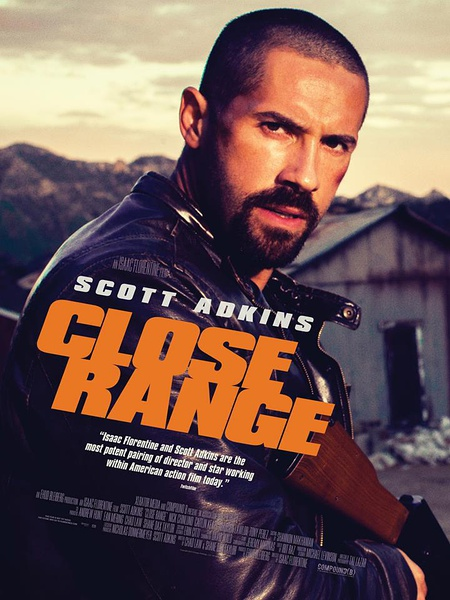
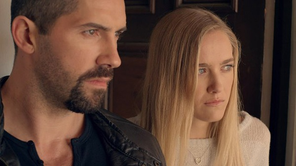
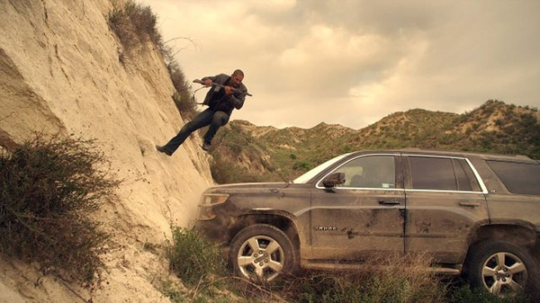

《近距离 Close Range》

			

老公的评论：

　　算是一部爆米花电影吧，挺热闹的，节奏也很快。

　　可能是因为年纪的缘故吧，其实对于电影中的特技特效没那么感兴趣，喜欢的反而是好的故事情节与剧情表现。

　　对斯科特·阿金斯一直没有特殊的喜好，作为一个动作明星来说，我觉得他的外形并不是我喜欢的那类——或许是他的脸型偏长，怎么看都显得有些瘦弱感。

　　《近距离》是个很简单的故事，又是美式孤单英雄类的。我觉得这部电影可看，可看在剧情上并没有什么不和逻辑的地方，也许主人公的功夫太高，也许电影中的反派太笨，也许主人公的妹妹和外甥女演技太差，但毕竟，它的剧情逻辑是合理的。

　　每次看过这样的电影都忍不住有个疑问：要是当过兵的都像主人公这么厉害，一个人可以灭掉一个黑帮，那世界上的黑帮都是哪儿来的？这样看来，我们的抗战神剧似乎也没有那么过分了……

　　可能是看得太多吧，越来越觉得电影不好看了，没有美剧好看，电影中能够展示出来的细节太少，更难。如今已经彻底进入了文化快餐消费的年代，我觉得电影还没有完全跟上时代的脚步，所以，也许很快电影的剧本和拍摄技巧方面就会有一次重大的突破或者是变革，我相信，那个时候的电影肯定是我这代人不爱看的——就像我的长辈们不喜欢我爱看的电影一样，哈哈

老婆的评论：

　　斯科特·阿金斯又一次演绎硬汉的形象。

　　该电影其实特别的简单，整体上就是一部近距离对战的动作片，以斯科特·阿金斯饰演的有问题的退伍军人，去救他的外甥女，对上了这个黑社会组织。

　　救出来外甥女后，不小心拿走了该黑社会保存所有信息的U盘，以至于整个黑社会组织来追杀他们，该黑社会在美国黑警的帮助下，很快找到了他们。

　　在其妹夫的帮助下，又很快的和警察打起来了，然后黑社会组织来了，逼着要回U盘，这场近距离的搏杀打响了，只是最终主人公是要赢得，以一对多的解决了这个黑社会组织。

　

　
上映年份 2015							
		
http://blog.sina.com.cn/s/blog_52187ba90102wqhz.html
