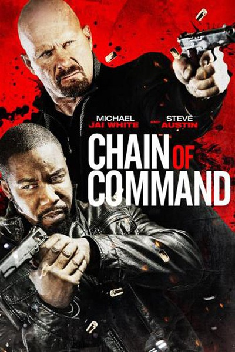
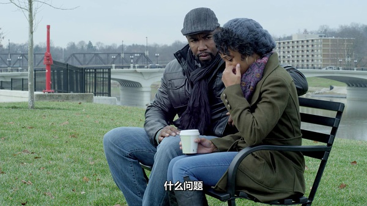

《连环劫 Chain of Command》

			

老公的评论：

　　除了主人公看上去很熟悉，其他真的没有什么太正能量的评论可以做出了，感觉上这并不是一部大成本的制作，不过看这样的电影，很有怀旧的感觉。

　　我很怀疑这样的电影会有票房吗？其实香港80年代这类电影有很多，这种孤胆英雄的电影不是不好看，个人感觉要是拍的酷一点还是很有市场的，但是这部电影太平淡了，或者说太写实了，而且剧情有些拖沓，让人看着有些提不起兴致。

　　从兴趣的角度而言，我和老婆大人都还是比较喜欢孤胆英雄的电影的，因为单线式剧情会显得很紧凑，这部电影在这方面做的还不够，虽然是单线式为主，但是无关角色的对白、场景太多了……

　　另外的一个看点是：这么热闹的枪战、杀戮，居然没有警察介入，可见影片中的美国警方效率也是挺低的……

　　除非你是Michael Jai White的铁杆粉丝，否则这部电影只是可看，绝对算不上精彩。

老婆的评论：

　　这部电影不是很好看。当动作片来看吧，主人公们一个个都是大块头，每打一下都很慢，很没有美感。主人公们一个个长的也不好看，所以感官上得不到满足。

　　整个看完，有点像孤胆英雄的意味，为了自己的兄弟，主人公挑了一个军队，当然这个军队都是由贪婪的人组织起来的，为了个人利益，牺牲了大家的利益。

　　故事总是这么演，腐败的部分军队人员最终要被个人人物打败，主人公得到了那4000万可以做点什么了。

　　对了，这个城市的警察哪去了？　　

上映年份　2015							
		
http://blog.sina.com.cn/s/blog_52187ba90102w7kn.html
