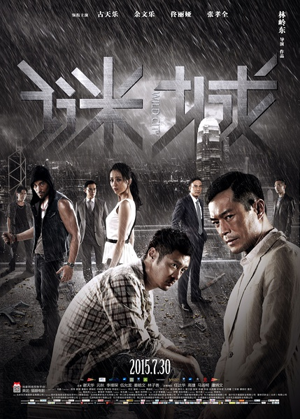
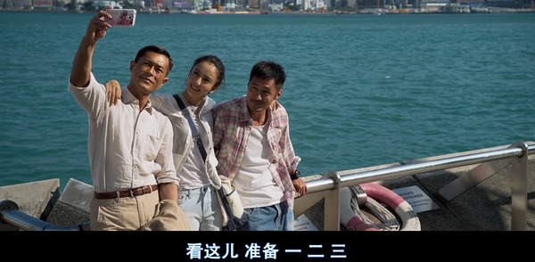
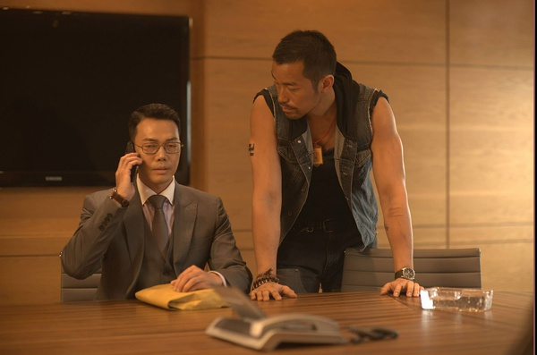

《迷城》

			

老公的评论：

　　说心理话，这部电影挺好看的，虽然站在上帝视角觉得好像有一些漏洞、不合理的地方，但是换位思考一下，这部电影的逻辑性很强，而且节奏感很强。

　　如果挑一个槽点的话，我会觉得古天乐饰演的角色在开头和结尾关于钱的论调似乎和整部戏不搭，因为整部电影围绕的就是一个“谜”的感觉，而并不是“钱”。比如主人公两兄弟，就不是那么贪钱……

　　古天乐在这部戏里显得有点老了，而任达华则显得年轻了不少，化妆真的很奇怪。余文乐饰演的“少聪”是一个典型的西方环境中长大的人，生活的经济方面或许不是很好，但是很快乐，过自己想过的日子，够吃够喝也就好了。不过这两兄弟在见义勇为的方面则有些过了，可能因为一个是混混儿，一个是警察吧，好像都不是怕事儿的人。古天乐在最后逼死那个台湾帮的杀手还是挺狠的，这样才没有后患吧。

　　这是一部非常有性别概念的电影，女主角的镜头虽然不少，但是实际上就是花瓶，我觉得导演本来可以考虑减少她的戏份儿的，这样可能效果更好一些。

　　李灿森好久没见到了，之前是在一部TVB的剧集中国看到他出演，虽然他长得比较有特点，但是整体来说，还是亦正亦邪，都可以演的不错的。高捷也很有老态了，不过演黑帮大哥也算是到位，一位很不错的角色演员。

　　港产电影里值得一看的作品，或许是不是大屏幕不重要，慢慢欣赏也许更有感觉。

老婆的评论：

　　看的时候，我觉得天明（古天乐饰）捡了小云（佟丽娅饰）是一个大麻烦，他弟弟少聪（余文乐饰）也因此陷入麻烦中。

　　人不能走错一步，一步错就步步错。所以，从他们捡来小云以后，无尽的麻烦，还好天明把最后的那个坏人给逼死了，不然将来还会有麻烦的时候。

　　天明很适合当隐士，他就好像一个旁观者那样站在那，看着人来人往，看透生活的本质，人什么都可以拿钱来买，青春、爱情……等等。

　　故事本身也很简单，情节也很平淡，但是整个电影看起来非常的流畅，而且逻辑上没有漏洞，这部电影挺不错的，值得一看。

谢天华（左）

上映年份　2015							
		
http://blog.sina.com.cn/s/blog_52187ba90102w7kl.html
