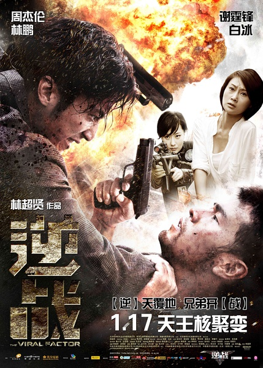
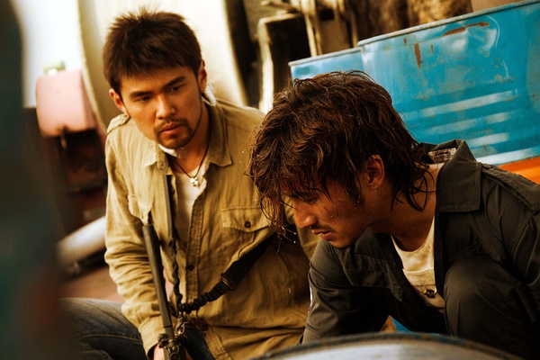
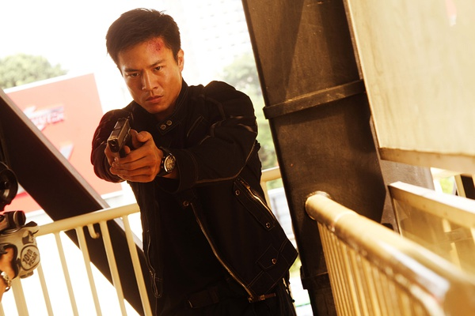

《逆战》

			

老公的评论：
 
　　不用期待这部电影有多好，但是这部电影也绝对没有那么差，一部电影的好与不好，很关键的一点是“你想在电影中看到什么”！
 

　　如果希望在电影中看到吸血鬼的酷、武侠片的飞来飞去、或者是巨石强森、周润发、月光宝盒……什么的，那就不必看这部电影了，因为看不到，但是我是觉得不会因为电影中没有这些桥段就不是好电影，我的态度是：对于不好的电影，根本就不必看完，更不要说看完再评论了，而凡是我能看完的电影，在我看来，都有它的可看性。
 

　　这部电影用一个字来概括，就是“打”，从头打到尾。就这一点来说，挺激烈！作为周末晚饭时的播放节目足够了。以我们的年纪来说，既不会追谢霆锋，也不会追周杰伦，所以，在看这部片子的时候，我们对演员们没有特殊的要求，只要打的激烈，够真实就好了。
 

　　英语、汉语普通话、粤语、马来语混着说，听着挺累的，不过真实感还好。不知道安志杰会不会演一次又能打、又善良的正面角色啊，他怎么总是演反派，难道这就是帅哥的下场？
 
　　片中的亲情戏不能说不好，但是在我看来，有些多余。
 
　　整部电影，还是有一些老港片的感觉的，不过可以算是变身之后的“老港片”吧，可看！

老婆的评论：
 
　　很打，是我对这部电影的最大印象
 
　　很多语言，是我对这部电影的第二印象。
 
　　整体来说，这部电影还能看。
 
　　安志杰我还以为这次要演一个正角没想到还是反派一个。
 
　　谢霆锋让我失望了，他怎么长成这样了，不帅不酷了。
 
　　周杰伦只能算中规中矩的了！

上映年份 2011							
		
http://blog.sina.com.cn/s/blog_52187ba90101hags.html
