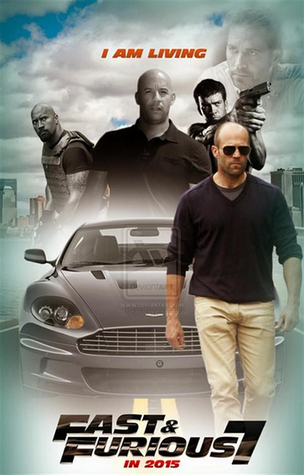
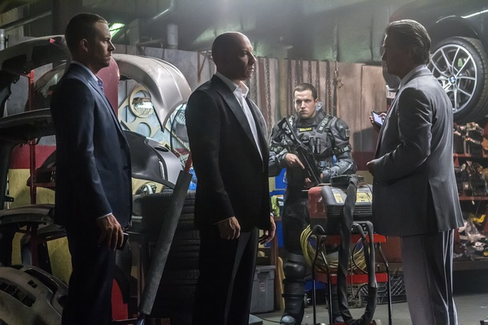

《速度与激情7 Furious 7》

			

老公的评论：

　　我觉得这一部没有之前的好看，其原因就在于这部电影的因果关系大多是暴力直接作用的结果，缺少了前几部看似巧妙的设计。可能是个人欣赏角度吧，我觉得高智商犯罪的影片不止是要有动作戏，高智商也应当体现出来。

　　说起动作明星，在现在当红的演员里，斯坦森我要给他第一名的，强森未必是第二，但总是前五名，而范·迪塞尔怎么也能排进前十——我指的都是在我的榜单里，从感情上来说，这部电影我是一定要看的。

　　没有一直称赞，不是因为我觉得这部电影不好，而是我觉得这么多大腕儿凑到一起，应该可以拍的更好，结果电影中并没有出乎我意料的惊喜。

　　保罗·沃克的离开为这部电影蒙上了许多的悲情色彩，不过就如同这部电影的结尾一样，他最后留给影迷的，是灿烂的笑容。

　　斯坦森这次饰演一个变态，居然也很成功，看惯了他演正面形象了，这次觉得原来他的戏路很宽。托尼贾在这部戏里的一些细节处理还真的有成龙当年的风采，看来中国想再出一个成龙、李连杰级别的动作明星还要再努力啊！

　　期待不强求，就是我对《速度与激情》下一部的看法。

老婆的评论：

　　很遗憾这部电影的主角保罗沃克永远的离开了。

　　斯坦森的加入，让我更想要去看这部电影了，谁叫他是我们最喜欢的演员之一呢。要说他还真演了不少的赛车的电影，可惜在这里表现的更多的不是车技而是面对生死的勇气。

　　这部电影他们增加了从飞机上忘地面扔汽车的镜头，从三个高楼上飞越的镜头，真是刺激，那下一部该如何让电影变得更刺激呢？我都想象不出来了。

　　至于故事的情节，其实没有之前那几部那么精巧好看，简单的来说就是复仇的故事。斯坦森演了反派，很暴力和很厉害的反派，这决定了最后只能是他熟了。

　　加上了上帝之眼，这部分的拍摄手法，我都觉得像《疑犯追踪》。

上映年份　2015							
		
http://blog.sina.com.cn/s/blog_52187ba90102w4js.html
