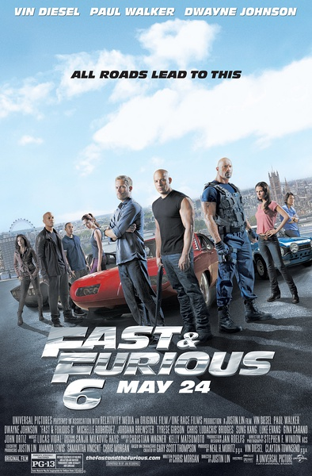
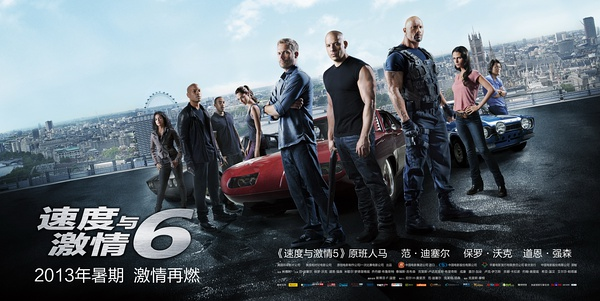
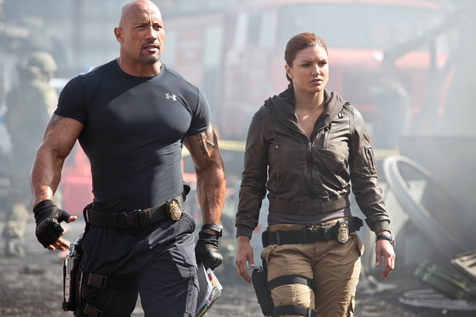
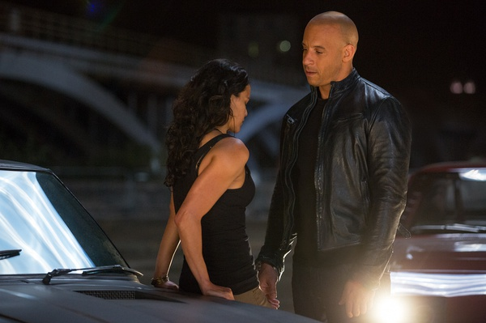

《速度与激情 Fast Furious 6》

			

老公的评论：
 
　　倒着来说吧，看完这部电影，老婆大人用期盼的眼光看着我说，“7呢，第七部有吗？”我觉得很难有一个系列电影做到这个地步。
 
　　这部电影有剧情、有巨星、有场面、有悬念，整体来说是最近我们看的最好的一部电影。
 

　　强森一直是我们喜欢的演员（不过之前刚看过的他的《付出与收获》，看不下去），范迪塞尔虽然不是最喜欢之一，但是他主演各种有关极限运动的电影也都很好看，不知道下一部戏中斯坦森加盟之后，强森还会不会继续出演，感觉上三个巨星同台，有点浪费票房而来，估计斯坦森来了，强森就会走了。
 
　　超性能的赛车已经够刺激了，这部电影中的打斗场景也很好看，特别是飞机上的三个大壮的搏斗，够酷！
 

　　在我们两个还在为“Han的孤单”而觉得不够完美的时候，一小段字幕之后的彩蛋让我们明白了，原来下一部连“Han”的戏也没了，那就难怪了。
 
　　接下来我们还要看很多电影，希望都像《速度与激情6》这么精彩。

老婆的评论：
 
　　最近看的电影，这部是最好看的，无论从剧情、视觉感官，过瘾程度来说，看的挺爽的。
 

　　在看这部电影之前，我们看过一档节目是特技赛车都是模型做出来的，现在赛车没那么危险了，都是做出来的吗？反正无所谓了，只要出品的成品精彩就行了。
 
　　结尾部分，斯坦森来了，看来他要来拍下一部了，主演巨石强森戏是不是要戏少了？很期待下一部。
 
　　无论如何这部电影值得一看。

巨石强森的身材是不是让人有点觉得恐怖了吧？！

 
上映年份　2013							
		
http://blog.sina.com.cn/s/blog_52187ba90101e036.html
