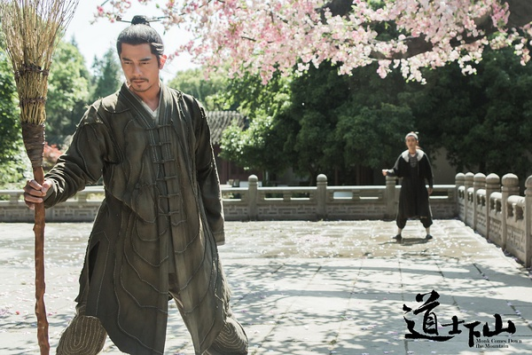

《道士下山》

			

老公的评论：

　　看这部电影的第一个感觉是：如何才能让一个长得很丑的人看上去不那么丑——答案是：让他扮演丑角。

　　王宝强的长相绝对算不上英俊，但是他在这部戏里的角色何安下却被他饰演的很成功。

　　看这部电影的调子，一看就是老派的导演，因为在故事中阴暗面的部分太多了，而阳光的、积极的东西太少。

　　拍什么样的故事是一个导演的权利，但是新一代导演、电影对于票房的冲击就在于他们和它们更贴近现代人的理解方式与心理状态。那些忆苦思甜的东西不能说不好，但是过时了。

　　每一个即将退休的拳王都试图捍卫自己的腰带，但是最终他们都将被击败，要正视现实，要正视自己曾经替代上一辈的历史，并且宽容地对待自己被淘汰出局。

　　《道士下山》的演员都还是挺不错的，演技也到位，只是除了耍酷之外，这部电影好像缺少了与时代的共鸣。

老婆的评论：

　　其实我不喜欢王宝强、范伟他们的影视风格。

　　何安下（王宝强饰）那个被师门放逐下山的小道士，在我看来，就好像是大富翁里的小衰神，他靠近谁，谁就倒霉，并不是他坏，而这就是他的属性。

　　崔道宁（范伟饰）死了吧，虽然是他的妻子和弟弟一起害死的，可发生在何安下来了之后，何安下的第一个靠山倒了。不过，还好的是，何安下为他们报仇了。

　　何安下接近另一个师父周西宇（郭富城饰），虽然周西宇死在他的师兄手里吧，还好，何安下找到查老板，也一同报仇了。

　　看，这些就是何安下是小衰神的证据啊。

　　从故事情节来看，这部电影居然有点像电视剧，有主线又由多个小故事组成。　

　　另外，小道士何安下这个人的性格，好像有点怪，在我看来武侠人物，没有人同他这样，随便就拜师。他的师父让下山是为了不饿着，他倒像是为了追求武功的更高境界。当然，事实证明再高再快的功夫，也没有枪厉害。要这样的话，何安下应该弄根枪才对。
　　
　　最终，我也没明白这部电影到底是想讲什么？

何安下的倒霉师傅之一

上映年份　2015							
		
http://blog.sina.com.cn/s/blog_52187ba90102w3s1.html
