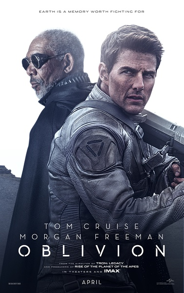
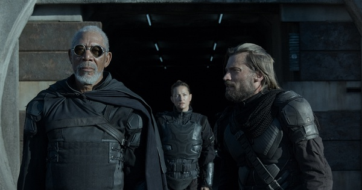

《遗落战境 Oblivion》

			

老公的评论：
 
　　这是继《速度与激情6》之后，近来我们看过的另一部绝对称得上优秀的电影了。
 
　　我个人比较老派，那些声光大制作一般刺激不了我的神经，我更喜欢的是一个好故事以及与故事般配的表现方式。
 

　　在看这部电影的时候，我感觉上就像一个故事在娓娓道来，每当我有疑问的时候，剧情总会在后面给与解答，比如我曾怀疑“既然还有外星人侵略者，为什么人类只安排了两个人留守……”，随着剧情的发展，我看到了“原来是这样”。
 

　　故事之中又外星、有核战之后、有克隆、有智能机器人……，很难想象这样的题材不用大场面来表现，也正是因为如此，就更显得导演、编剧以及演员的功力了。
 
　　依靠克隆人地球人来对付地球人，这个策略很卑劣，但是估计也很有效，外星人够聪明。
 

　　我相信电影里演的场景：如果真的有外星人来到地球的话，那么他们一定会利用自己的优势进行资源掠夺，多半他们还会给自己扣上宇宙和平的帽子。
 
　　地球反抗军里除了摩根·弗里曼之外，还有我们的一个老熟人——《永恒传说》的主角，看到熟人，总是乐事儿了。

老婆的评论：

 

　　刚开始的时候，我以为我们又要看一部只有两人主演的电影呢。还与老公比较就这么少人主演的电影哪一部最好看呢，不过，这部电影后面部分拍的真不错，而且结尾部分让我们有点激动，我也说阿汤哥的电影不至于那么差吧。

 

　　从49号发现他的爱人发现52号，电影就开始有一个大的转变，一下就有了内涵了。原来都是一场骗局，是一场外星人的阴谋，他们拿走杰克·哈珀的记忆，并克隆了无数个他，让他来对付地球人，而杰克·哈珀还以为自己是在保护人类，这是我见过最厉害的外星人了。
 
　　然而49号杰克·哈珀有点不同，他对地球的某些东西还有感觉，正是他的这种感觉，救了他的妻子，最后也拯救了地球。
 

　　在看这部电影的时候，看到49号用自己嚼过的口香糖修166号无人小飞机，我还以为将来在战争中166号小飞机会来帮助他呢，遗憾没按我的想法演。

上映年份　2013							
		
http://blog.sina.com.cn/s/blog_52187ba90101e0k3.html
