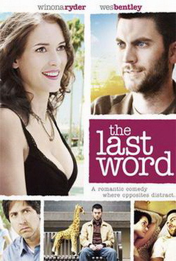
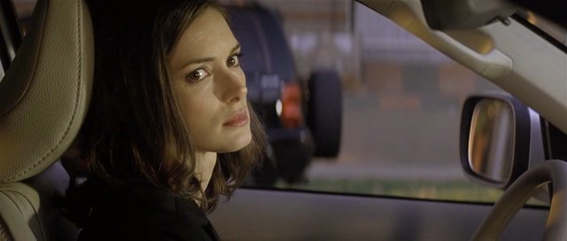

《遗言 Last Word》

			【夫妻影评】《遗言 Last Word》

老公的评论：
 
　　谈不上是个很好看的电影，但题材够新颖，让我感觉很另类，并且对主人公得职业很感兴趣。
 

　　我很感谢电影的导演，并没有把主人公拍摄成那种很俗的人，那种劝人不要自杀的人固然有着一定的社会意义，但那样的话，恐怕这部电影要花多的多的成本才可以让观众记住，而现在则好了很多。
 

　　比主人公职业更另类的，是在一个“死亡”题材的故事中穿插了爱情的背景，尽管觉得西方人的爱情来得太容易，但依旧会对男女主人公的分手感到惋惜，或许一切都说出来会好很多。
 
　　爱情之中，是不该有谎言的。
 

　　当然，电影最后的结尾也不错，发泄，在生活当中确实很有必要，钢筋水泥的城市之中，大家带面具的时间或许都太久了，只有适当的发泄，才能让现代人处于一种正常的心态之中……
 
老婆的评论：
 
　　这部电影我只是觉得还能看。
 

　　有人要自杀，主人公Evan的工作是为这些要自杀的人，写遗言的。一直以来他就这么生活中，当有一天他认识了一位死者的妹妹并成为他女友时，一切都发生了变化，他的职业，或者是因为女友的哥哥，他羞于对女友交代他的真实职业，就瞎编，结果还是被识破，女友与他分手，不过，最后Evan选择了另一种生活状态，他不在写遗言了，而是帮助这些人发泄自己的情绪了。
 
　　整部电影挺压抑的，Evan过着特别沉闷的生活，即使对女友，我也很少见他开心的笑过。
 
上映年份 2008
 
导演
Geoffrey Haley
 
编剧
Geoffrey Haley
 
主要演员
 Evan……Wes Bentley
埃文……韦斯·本特利（右）
 

Charlotte……Winona Ryder
查罗特……韦奥娜·里德尔							
		
http://blog.sina.com.cn/s/blog_52187ba90100h1ld.html
