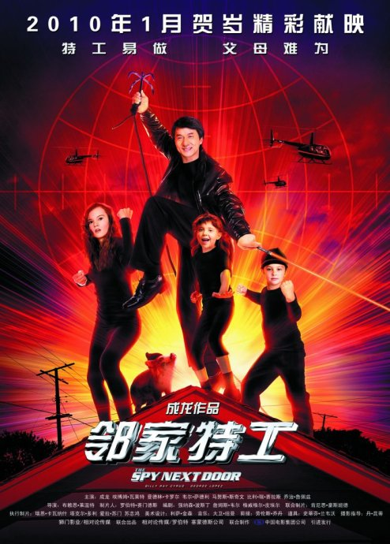

《邻家特工 The Spy Next Door》

			【夫妻影评】《邻家特工 The Spy Next Door》

老公的评论：
 
　　看了之后，第一感觉是很上当。
 

　　看美国的电影，经常会遇到这样的情况——有一些很多很多年或者是用了很少很少的钱拍的片子，也冒充新大片推出，感觉上这部电影就是这样。
 

　　不知道是全球电影业的滑坡还是自《无间道》之后美国电影抄袭香港电影上了瘾，怎么看，这部《邻家特工》都像是陈龙80年代末期的作品，要不是里面的成龙是在老的可以了，真的很难相信这是新拍的电影。
 
　　不是很好看，看玩就忘，没有特殊的桥段……，这就是我对这部电影的评价，说不出别的什么了……
 
老婆的评论：
 
　　没想到成龙拍了一部这样的影片，挺轻松挺温馨的，只要你放松心情，跟着电影放心的笑就好了。
 
　　这部影片个人觉得适合小朋友看，影片中的坏蛋太笨，是那种《三个笨蛋》的那种搞笑的笨。
 
　　算算成龙该是当爷爷的年龄，他的功夫用这种方式演绎，也算是一种不错的选择吧。
 
　　总的来说，值得一看，却真的没什么可写的拉。
 
上映年份 2010							
		
http://blog.sina.com.cn/s/blog_52187ba90100hy9g.html
