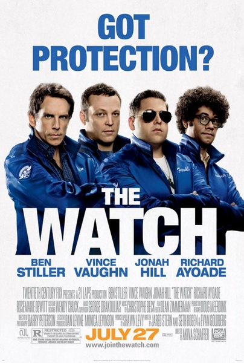
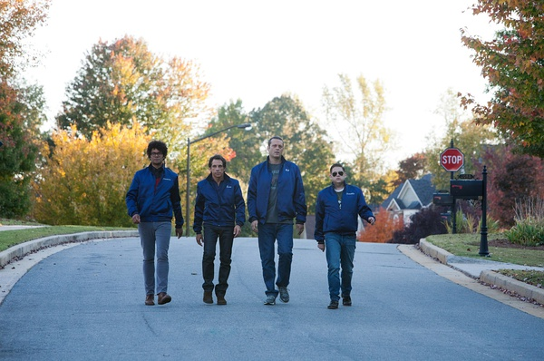

《邻里联防队 The Watch》

			

老公的评论：
 
　　因为《热带惊雷》而认可了斯蒂勒的喜剧天分，这部电影也是因为他才决定看的。
 

　　故事的主角是一个一腔热血的普通市民，很普通，很热血。我觉得虽然我们的文化和美国文化有着很大的差异，但是现今的世界中，无论是在怎样的文化背景下，都需要有这样的热血人士活在这个社会上。
 

　　在影片开始前，我不知道这是一部有科幻内容的电影，甚至在影片开始了一段时间，我都以为是纯粹的喜剧，后来看到了科幻的元素，虽然觉得外星人并没有带来什么惊奇，还是走入侵地球的老一套，但是邻里联防队队员的热情还是挺让我羡慕的。
 
　　另外值得一提的是乔纳·希尔，他的《龙虎少年队》让我一直难以忘记，也记住了这个小胖子。
 
　　唉，挑点毛病吧，剧中的粗口太多了，不是很舒服，不过不影响这是一部好看的喜剧。

老婆的评论：
 

　　刚开始时我嫌这部电影的节奏有点慢，后来变快了点，就是他们的一些对话我不是很喜欢。多了这些外星人是不是就成了科幻片了？但这部电影外星人换成其他的人也没有问题，因为最终想讲的大概是四个男人交朋友的故事吧。
 

　　艾文的超市值班警卫被谋杀了，警方迟迟没有破坏，为了破案也为了这片区域的安全，艾文决定要组织邻里联防队，艾文的决定有了另外三个男人的响应，就这样，他们在工作之余在这片社区里巡查，直到有一天，他们的汽车碰到了某种东西，电影开始有点意思了。
 

　　外星人想要全面侵略地球，他们杀害人还拿走人的皮，这样外星人就可以潜伏在人类之中了，在这个过程中邻里联防队，有过分歧有过和好，最终他们利用那个外星武器把外星人杀死了。
 

　　最让人没想到的是，这邻里联防队的小黑也是一个外星人吧，不过是在他的帮助下才战胜外星人的。而，艾文与妻子的问题也得以解决，算是比较圆满的结束吧。　　
 
上映年份：2012							
		
http://blog.sina.com.cn/s/blog_52187ba901017hay.html
