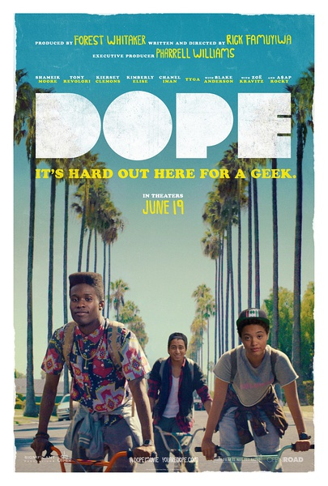
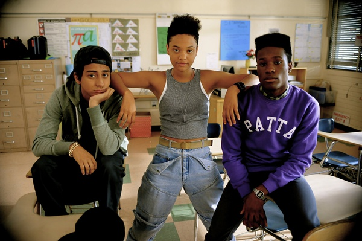

《酷毙了 Dope》

			

老公的评论：

　　很难评价这是一部什么样的电影，青春、励志、罪案、高智商犯罪……？

　　看过的为数不多主人公都是黑人的电影？主人公们为了能考上大学居然从无辜的受害者变成了毒贩子，而且最后居然全身而退，马尔科姆居然还能进哈佛……？难道美国的小孩子都是这么长大的？

　　之前就有想法——那些所谓的青春题材的影片到底是拍给谁看的？青少年，还是再也回不去青春的中年人……

　　这部电影有些黑色幽默，结尾升华了一下，但我依旧无法把它当做一部正能量的电影，看完多少有一些压抑……

　　移民北美，如果没有选好城市，选好城区，也挺可怕的！

老婆的评论：

　　看的时候这部电影很长很长，也不知道会是如何结束，我想一直看这三个小朋友被欺负也不知什么时候才是个头？结尾却人我觉得这部电影真的不错。

　　从这部电影里我们看到，如果你不想让自己犯错误的话，那么一定不要给自己犯错误的机会，马尔科姆（Shameik Moore
饰）因为喜欢上一个姑娘，所以去了他不该去的酒吧，导致后来发生了很多很多的事情。当然，如果你有办法解决这些问题的话，那这些都不算什么事了。

　　大部分时候我觉得美国的高中生很成熟，解决问题的方式不同，能力也挺高的。就如马尔科姆这般，虽然逼迫做了很多的事，但是还把教授给算计进去了，最后应该如愿的进入了哈佛。

　　真是酷毙了！

这姑娘哪里好看了？

上映年份　2015							
		
http://blog.sina.com.cn/s/blog_52187ba90102w6by.html
