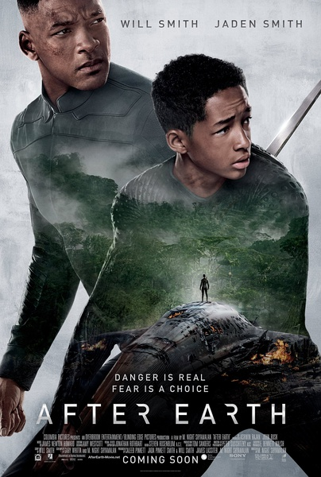
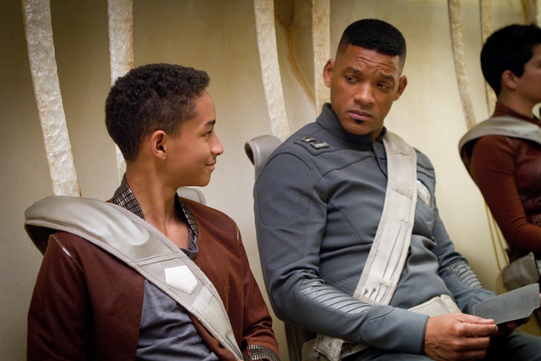

《重返地球 After Earth》

			

老公的评论：

　　两个人主演的电影，演员是一对父子，看起来还不错。

　　对威尔·史密斯更多的还是搞笑与动作片，这次他演一个严肃的父亲，还是挺有味道的。至于小史密斯，没有什么好与不好，他的年纪决定了他的演技。

　　故事的好看在于对地球未来的面貌的重塑，如果当人类迁出地球或者人类灭亡了之后，地球真的成了这样呢？多美啊！

　　电影里的那种像老虎又像豹子、狮子的动物，是地球上现有的猫科动物演变而成的吗？现在的动物真的还在演变、还在进化？那也太有意思了？真想看到1000年之后的未来地球是什么样子，这也是我一直幻想着遇到Doctor
Who的原因。

　　昨天这部电影，觉得会在梦里梦到电影里的怪兽，结果真的梦到了，还大打了一架，嘿嘿，在梦里历险是最刺激、最有意思的事情了，酷！

　　对于片子中关于伦理啊、励志啊什么的没什么感觉，希望能看到关于自然环境描述的科幻题材的电影。

老婆的评论：

　　看着那未来不适应人类地球，我觉得我还挺喜欢的，那地球会不会重新循环，生长新人类，可以适应之呢？

　　虽然这部电影主要演员就史密斯父子俩，我觉得还挺好看的，不管是从剧情和对地球的勾画，包括那只大鸟为了报恩，用自己的生命保护吉泰那段，多么感人。当然，我想电影最想传递的，应该是吉泰战胜自己的精神，值得学习。

　　电影的整个逻辑还是挺圆的，前期对吉泰训练的特写，和没有顺利晋级，不是成绩不好是有某些心理障碍，在母亲的要求下游骑兵最高指挥官瑞奇他的父亲准备把他带在身边一段时间。

　　他们的飞船出现故障掉落在地球上，只剩下父子俩，而父亲瑞奇还受了重伤，去取通信器的任务就落在了吉泰的身上，在这个环境恶例的地球上，吉泰克服种种困难，克服自己的心理障碍，最后还杀了那只凶猛的怪兽厄萨，成功的发射了信号。

上映年份 2013							
		
http://blog.sina.com.cn/s/blog_52187ba90102vp4j.html
