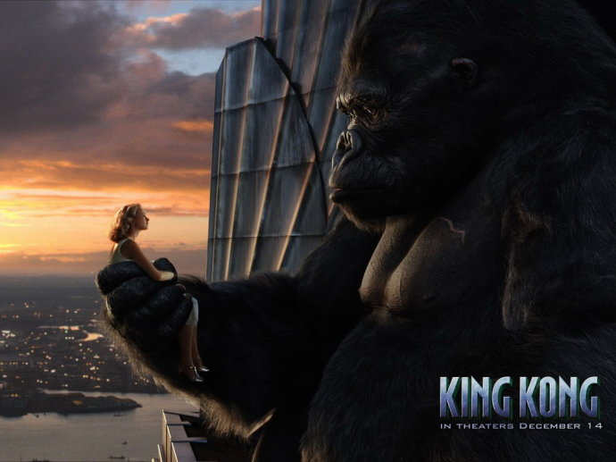

《金刚 King Kong》

			【夫妻影评】《金刚 King Kong》

老公的评论：
 
　　好友小马的夫人因为最后金刚的死亡而不愿意观看这部电影，她真的错过了一场视觉盛宴。
 

　　模糊的印象中，我似乎看过三十年代《金刚》的介绍，所以新版的《金刚》上市之后，一直没有关注过，拖到了今天才看，看过之后，感觉很精彩，感觉不容错过。
 

　　我觉得看科幻片，分两种模式，一种模式是真的去看里面的科幻元素，比如我一直很推崇的《神秘博士2005》，而另一种，就是去享受在科幻背景下的，由导演呈现给我们的各类异型，异形生物，异型建筑，异型武器……，《金刚》绝对是后者。
 

　　写到这里，我想到了我没有在第一时间看《金刚》的另一个原因，在目前地球上的我已知的生物当中，我最不喜欢的可能既似乎灵长类的动物了，一定是这个原因。不过这次电影中的金刚争了口气，一挑三痛斩霸王龙，太厉害了，伟大的灵长类！
 
　　其实在这部电影之中，我更喜欢的场景是骷髅岛中各种幻想的怪兽场景，这种环境太让人向往了，真的很想去。
 
　　时间有点长，但是是一部好看的电影，喜欢恐龙的朋友不要错过哟！
 
老婆的评论：
 

　　毫无疑问这是一部我非常喜爱的影片。金刚死时，我甚至留下眼泪，真的很遗憾！老公说我为动物掉眼泪，为艾迪小飞机死去遗憾，说是因为这些都是主人公。其实也没有这么绝对，我只是不喜欢一个有感情的东西死去。
 

　　影片中的制片人卡尔说金刚是为了美女安死去的。那么野兽爱上美女要是在荒山野岭的话，野兽能够充当英雄的角色，就如金刚，霸王龙厉害吧，几头霸王龙是不是无敌？那有怎么样，还不是把安保护的好好的。遗憾的是，金刚被抓到了城市，他还试图保护安，这场不该有的感情，终将是悲剧，金刚悲壮的牺牲了。
 

　　这是一部探险的故事，这个有偏执狂的制片人卡尔有一个非凡的梦想，要找到一个消失的骷髅岛拍一部不同的影片，我真的不喜欢卡尔，正是他的残忍，金刚才会死的。骷髅岛岛上有一个原始部落，这些人非常的可怕，到处都是死人的场面，让人毛骨悚然。安被抓这些土著抓去祭祀给了金刚，为了救安，人们踏入了神秘的土地，像似回到了远古时期，遍地各种远古生物，这个让我看的挺过瘾的。
 

　　也是一部科幻的影片，现实世界上怎么还会有这么多的远古呢？！今天看一则新闻说：“日本有望五年内复活猛犸象”，也许未来看见远古生物就是现实。
 
上映年份2005							
		
http://blog.sina.com.cn/s/blog_52187ba90100nrf8.html
