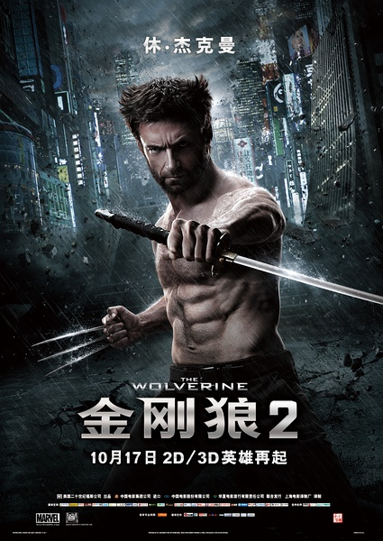
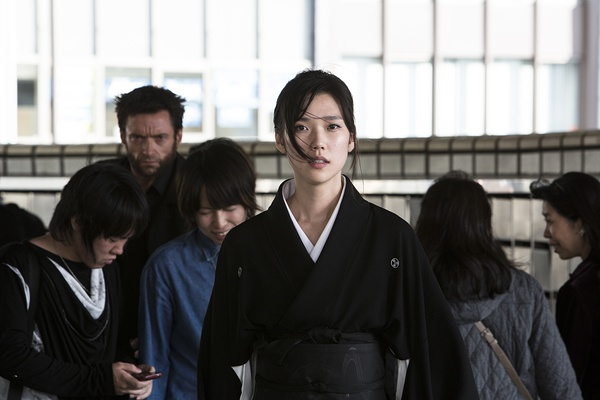
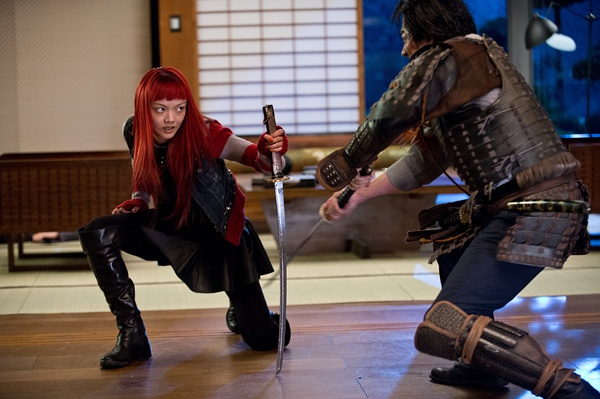

《金刚狼2》

			

老公的评论：
 

　　看过之后，其实觉得关于电影没有什么好写的，除了日本老头挺坏的这点——用残害的手段来对付自己的救命恩人，看来美国人对日本人的看法也不怎么样。
 

　　总的来看，这个故事和之前的金刚狼没有什么关系，是一个完全绝对独立的故事，故事的主人公不是金刚狼也无所谓，只要是个有超能力的人就可以了，所以，略有些奇怪。
 

　　红头发的女人长得很“指环王系列”，真理子长得也算不上好看，不知道金刚狼和自己朋友的孙女有一腿到底是什么样的心态，可见西方人和我们的思维方式真的很不一样。
 
　　这部电影最后虽然X战警的两位老大都出来了，但是整个故事和X战警真的一点都拉不上关系，挺莫名的。
 
　　说实话，要是这样的话，再有第三部就可看可不看了。　　

老婆的评论：
 
　　美国怎么没一下喂日本几个原子弹呢？！
 

　　这部电影相对来说不是很好看，一个贪婪的日本人想起曾经的恩人金刚狼来了，他要金刚狼的不死之身，为此他派人去对金刚狼说临时前想与他见一面。
 
　　开始时还觉得他孙女也参与了这趟阴谋，慢慢的发现不是这样，并且和金刚狼相爱了，呵呵，爱情真能跨越年龄。
 
　　不管怎么说那个日本人最终没有得逞。

上映年份 2012							
		
http://blog.sina.com.cn/s/blog_52187ba90101hs9s.html
