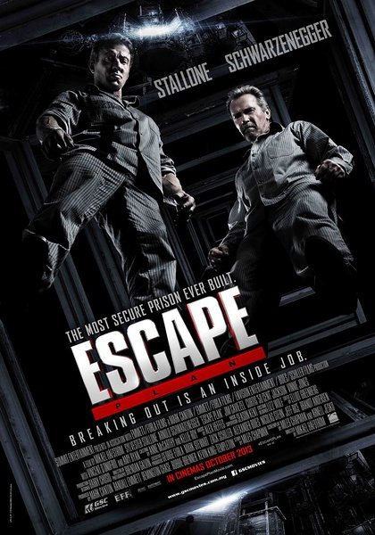

《金蝉脱壳》

			

老公的评论：
 

　　受《第一滴血》的影响，我一直是很喜欢史泰龙，我说的不是《第一滴血系列》，就是《第一滴血》！十二三岁的年纪，看到这么厉害的兰博，想不崇拜太难了。
 

　　《金蝉脱壳》是最近看过比较不错的电影，感觉有些不严谨的地方是监狱中虐待史泰龙的那部分，交代的有点不清楚，怎么那些恶人没有达到目的就放手了？这部分可能是后期剪辑的问题吧。
 

　　史泰龙和阿诺都老了，这部电影的内容虽然是创新的，但是感觉上却很怀旧，至少对我来说是这样的，如果不是之前对他们两位巨星的印象，我想我是不会提起兴趣看两个老头演的片子的。
 

　　故事里有两点我没看明白，一是史泰龙的搭档为什么要陷害他？二是在史泰龙帮助阿诺越狱后，要不要再通知警方把他抓回去？这两个问题让我琢磨了很久。
 
　　因为美剧看的太多，所以熟人也越来越多，变态的监狱长是我和老婆大人都非常喜欢的角色，能在这里看到他，觉得很有趣。

老婆的评论：
 

　　对于我来说这部电影的遗憾，就是主演是史泰龙，不是他不好，而是他太老了，与他年轻时比较，现在的形象真不怎么的，真希望这个主演是米勒。相比的话，施瓦辛格老了的形象都比史泰龙强。
 
　　除此之外，整部电影我很喜欢。
 
　　美国的工作可真多样的，连越狱也是一种，呵，有点意思。
 
　　詹姆斯·卡维在演《疑犯追踪》时，我和老公就特喜欢他了，这次演典狱官霍布斯，演的不错，只可惜是个反派角色。
 

　　在看这部电影时，我也一直在猜，到底是谁要把雷搁进监狱不想让他出来呢？答案一定是他的搭档，这个我猜到了，也猜到了，出钱让测试监狱其实是为了帮助埃米尔越狱。这点，我佩服自己，哈哈！

上映年份　2013							
		
http://blog.sina.com.cn/s/blog_52187ba90101fuqa.html
