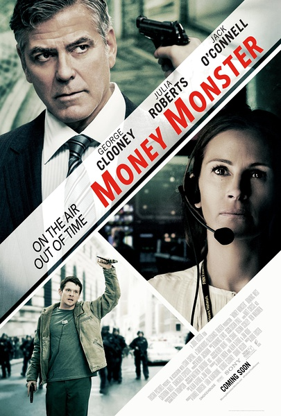
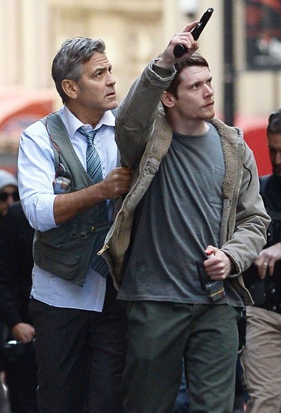

《金钱怪兽 Money Monster》

			

老公的评论：

　　讲真，这部电影还是不错的——尽管有人持枪进入直播间挟持主持人已经是个高危事件了，但是电影中最紧张的情节却不在此，而在于一次股票欺诈！

　　克鲁尼扮演的这个角色还是很逗的，而且很有代表性：平时一副大大咧咧的样子，而且我行我素，看不起其他人，但是这种人的良知一旦被唤醒，却还是有着一定的正义感的。

　　对于影片结束前“绑匪”被狙击手杀掉的一幕，我倒一点没觉得“绑匪”值得同情，即便那个背心炸弹是假的，但是整个事件所造成的社会危害实在太大了，如果每个股票赔钱的人都这么做，社会治安风险太高。

　　觉得这部电影还可看，是因为这部电影支持了我的一个观点：股评人说的话其实没有稳赚不赔的依据的，否则的话，这些股评人早就都成了巴菲特了，谁还有功夫给你讲解股票……

　　不由得想起了另一句话：金融行业总是与投机有关，它们自身并不创造价值，而是攫取利益！

老婆的评论：

　　在我看来，投资回报高的金融理财产品很具有风险性，所以老百姓不要像本片的主人公科尔（杰克·奥康奈尔饰）那般把所有的钱就这么投进去，最后要靠绑架主持人，牺牲自己的性命来换取投资的真相，不值得。当然，有一句话借此机会在这分享一下“大多数时候犯错误，不是因为你愚蠢，而是因为你贪婪”。

　　就本片剧情而言，我觉得剧情紧凑，进展的也很快，人物不多，但每个角色都挺有作用的。

　　在这个小小的直播间里把故事描述的那么清楚，我觉得编剧很厉害。我对这部电影的两个角色很喜欢，一个是主持人李·盖茨（乔治·克鲁尼饰），在主持节目的时候各方消息在他耳朵里出现，他要听进去并且合理的应用在他的节目中，真是厉害。另一个是导播帕蒂·芬恩（朱莉娅·罗伯茨饰）她在瞬间要做出很多的反应，统筹并分下去任务，太厉害令我佩服。

　　8亿美元股票的蒸发，在帕蒂·芬恩的领导调查下，真相水落而出，只是那家公司领导者的一场金融阴谋而已。

上映年份 2016							
		
http://blog.sina.com.cn/s/blog_52187ba90102x1mo.html
