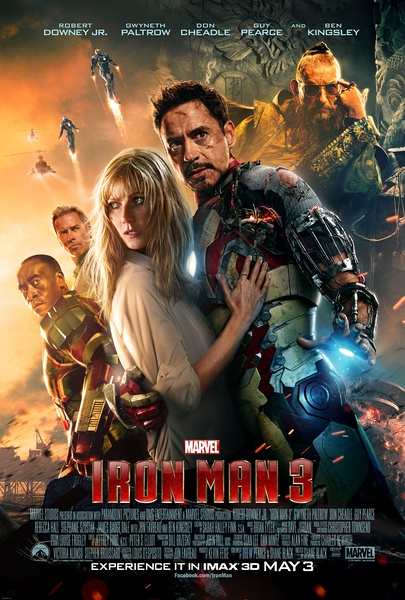
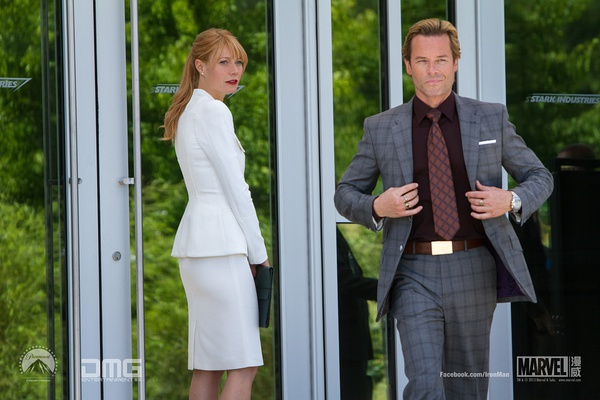
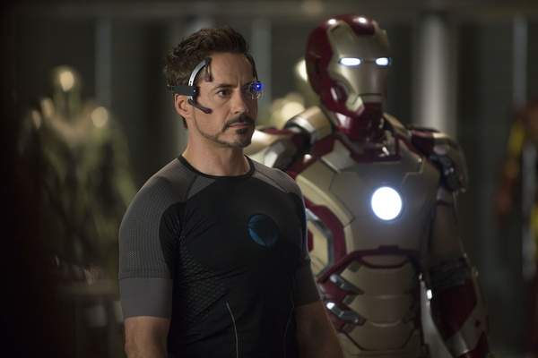
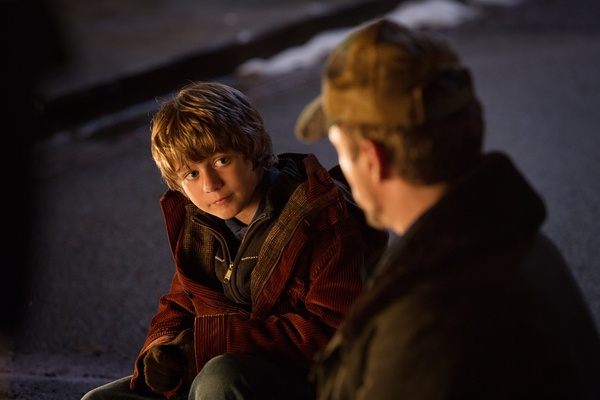

《钢铁侠 Iron Man 3》

			

老公的评论：
 
　　机器人都毁了，这应该是最后一部《钢铁侠》了吧？
 

　　从视觉效果来说，这部《钢铁侠》我觉得比前两部要逊色了很多，看《钢铁侠》，对我来说，并不是看小罗伯特·唐尼，而是看那个机器外壳带来的眼耳感官享受，如果掺入太多剧情的话，至少对我的吸引力降低了许多。
 

　　在我个人看来，这部电影的反派其实做的还是不错的，只不过缺乏了一些创新——又是超能战士，这让钢铁侠陷入和超人、蝙蝠侠同样的竞争环境里，失去了独立的特色。
 

　　比起空中大战来，那些让元件自动组装的桥段虽然多了一些科幻的意味，但是更显得像是雕虫小技，而对故事的主线并没有起到什么帮助。如果说是要歌颂爱情的话，其实我也没看出什么。
 

　　《钢铁侠》本身是很让人喜欢的题材，这么结束其实挺好的，也许还会留下一些余音绕梁的回味，不要等大家都真的看不下去了才终止。

老婆的评论：
 
　　钢铁侠终于要退休了，不再出新了吗？不过也是，要出新的话，还需要造出敌人来。
 
　　不得不说，这次的钢铁侠场面还是很壮观的，在船上打的那一仗，出动了那么多的机器人，反派阿尔
德里奇·基连也造出了很多火人，甚至把钢铁侠的女友佩珀·波茨也变成火人，最后他就败在佩珀·波茨
身上，所以说不要妄想别人的女友站在自己那边。
 
　　那个恐怕头头曼达林，居然是一个演员，是反派阿尔德里奇·基连塑造出来的人物，这一点他还是很
聪明的。
 
　　这次托尼·斯塔克可以召唤他的钢铁侠，他还能分离开同步，感觉上挺酷的。
 
　　我特喜欢钢铁侠的那个智能管家贾维斯。我也喜欢钢铁侠遇到小朋友那段，虽然这种桥段不少电影里
有。

                                     托尼·斯塔克和他的钢铁外壳可以分离了

上映年份　2013							
		
http://blog.sina.com.cn/s/blog_52187ba90101fvr7.html
