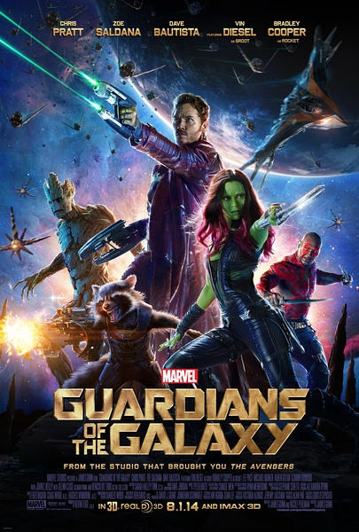
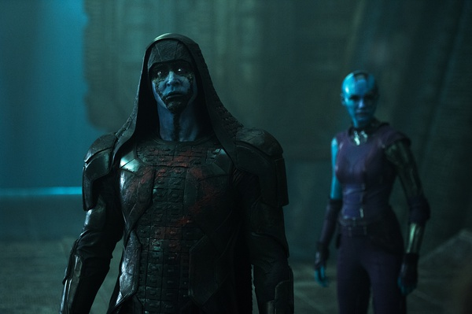
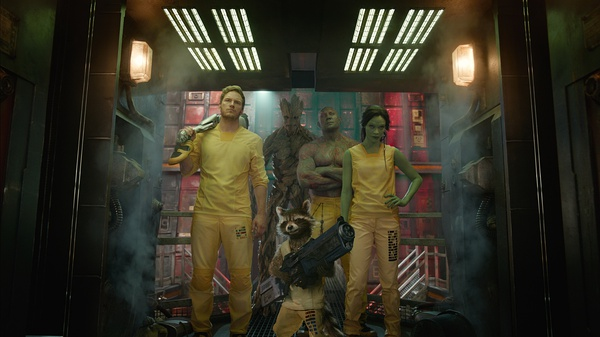
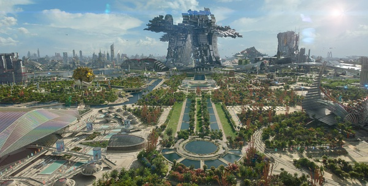
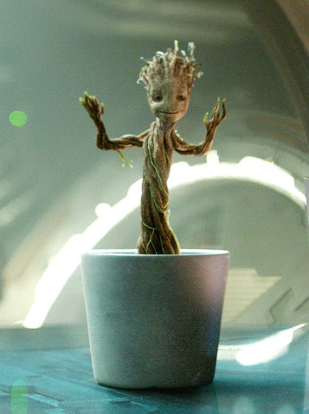

《银河护卫队 Guardians of the Galaxy》

			

老公的评论：

　　大部分的漫威作品我们俩还是很喜欢的，而这部《银河护卫队》更是让老婆大人笑不绝口。

　　在我个人看来，这部电影给我很深的“仿古”的感觉，里面的飞船还有主人公的职业让我很容易想到了“萤火虫号”，这让我看这部电影的亲切感又增加了许多。

　　除了最开始出现于地球之外，电影并没有什么涉及地球的情节，要是能够增加一些主人公和地球的联系就更好了，至少可以让我看看宇宙间物种的区别和变化。

　　浣熊人和树人是让老婆大人开怀不已的重要因素，浣熊人在我看来还算一般，但是树人的感觉真的挺不错的。在片头我看到了范·迪塞尔的名字，在片中找了很久，最后才弄明白，原来他只是给树人配音的，哈哈。听说他还给各种语言版本的树人配音，有意思！

　　对比最近看的《星际穿越》，我觉得《银河护卫队》才算是传统意义上的科幻片，哈——这也就是我说的“仿古”的感觉。

　　如果有续作的话，我希望里面的外星物种再多一些，会更有趣。要是可以的话，我和老婆大人都觉得养个树人是不错的想法！

老婆的评论：

　　银河护卫队，我等着你的归来额！

　　我很喜欢这部电影，看的时候爱死小浣熊火箭和树人格鲁特了。你说格鲁特你要钱干嘛？说要分钱的时候还得他来一份，把我笑死了。在监狱里大家还在商量计划，他听见要拿下那个电池，什么也不说，直接就去拿下，真憨啊，最后又为了保护大家被炸成条了，还好，慢慢的他又在盆里长大了，要不然我该不高兴了，之后的他应该挺还会跳舞吧！我要一个格鲁特，忠诚憨厚……的格鲁特。

　　这部电影不怎么拖拉，给了点镜头交代彼得小时候被外星人抓走，完了就是长大后的彼得在星际中找宝贝，当大盗了，功夫不错。而这次彼得找到的小球，勇度要他又不给只好派赏金猎人来抓他了，另外罗南要，找杀手卡魔拉来抢，这几个人又被抓进监狱，德拉克斯是在监狱里认识的，银河护卫队就这样组成了。

　　彼得拿着那个球体元素没有被炸掉，我当时还以为是几个小伙伴帮他分担了呢。后来说因为他父亲身体里有古老的外星人元素，估计下一部该交代彼得的父亲了吧。

银河护卫队人员终于齐了

这个星球的感觉很不错

养一个格鲁特，你会喜欢？
　　
上映年份 2014							
		
http://blog.sina.com.cn/s/blog_52187ba90102vcy7.html
