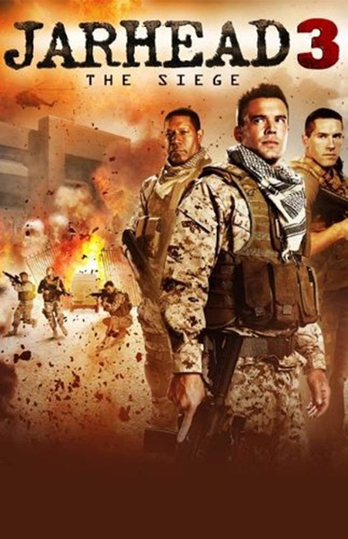
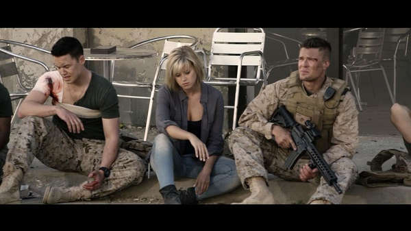

《锅盖头3 Jarhead 3: The Siege》

			

老公的评论：

　　是因为新吗？觉得这部电影比前两部好看了许多，不仅是情节精彩、紧凑了许多，人物形象也刻画的更鲜明。

　　斯科特·阿金斯饰演的角色死的很英勇，他完全是为了掩护队友才暴露自己遭到攻击的，不过这好像是《锅盖头》系列的套路。

　　电影中反派头目的演员化妆和表情很到位，简直就像是一位被召唤出来的恶魔。

　　记得小的时候，总是会问奶奶故事中哪边是好人哪边是坏人，甚至是看京剧的时候也会从这个角度去找自己支持的一方。长大之后发现，对于悠悠的历史长河来说，基于政权的斗争并没有好人与坏人之分，成王败寇真的是一点都不错。

　　本来想评论一下美国四处驻军四处干涉别国内政……，再一想，电影就是电影，看看，热闹热闹，就完了！

　　很打的一部电影，爆米花，可看！

老婆的评论：

　　有信仰对于个人来说，是否意味着牺牲？看本片那些不断死在枪下的中东人士，是否是恐怖分子，是不是也是相当的？

　　美国使馆被这群中东恐怖分子包围了，他们还要去取对他们国家还威胁的信息，这是不是也是一种信仰。

　　整部影片都在一种很激烈的对抗中进行，枪声不断，火箭炮时不时来一下，人不断的倒下，队长为了掩护队友被炸死了，很壮烈。

　　最终，使馆的战士们等到了支援。而新一轮的故事又要开始了……

上映年份 2016							
		
http://blog.sina.com.cn/s/blog_52187ba90102wrdz.html
