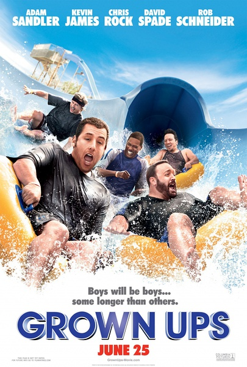

《长大后 Grown Ups 1 2》

			

老公的评论：
 
　　有的时候，看一些不用动脑的喜剧还是挺能消磨时间的，不过，由于文化的不同，所以不是很能理解主人公们的感受。
 

　　其实对这两部电影没什么好评论的，讲的就是小学同学30年后再相逢，一起搞笑的故事，在电影里面，包含了亲情、友情、爱情……，就这些……，看这部电影，更容易有的感触是来自自己的感受。
 

　　论年纪，我比电影里面的主人公们要小一些，但是，和小学同学确实已经很久很久没有联系过了，准确地说，除了一位小学同学也是我的高中同班同学之外，别的人已经失去了联络，这固然和拆迁以及世界的变化有关系，但是从另一个角度来看，交通越来越发达，但是我们之间的距离确实越来越远。
 

　　还是说回电影吧，《长大后》的笑料其实是有些“过时”的，这让两部电影都有一些“旧电影”的感觉，这种感觉本身就是一种很怀旧，很有回味感的感觉。
 
　　老实讲，《长大后》系列谈不上多精彩，只是可看。

老婆的评论：
 

　　很温馨的，我觉得第一部比第二部要好看。主要体现在第一部的合理性，这场当年冠军之争还让另外一些小伙伴如今的男人们还耿耿于怀呢。
 

　　那场男球比赛，终究让对方赢回来了，主人公费德还了对方一个心愿，这样看来主人公还是很有爱的。第一部里卡林娶了这么一个老太太当老婆，看来真爱真的可以超越年龄。
 

　　第二部大混战也太不像现实中那般吧。而这部是另外一个男人成全了主人公在儿子那的榜样，这也非常的有爱。这部中费德主人公居然把儿子的天才腿给弄断了，太背了。
 
　　我一直在想，我在与我们的那些朋友们见面是什么样的场景，我想都不会是电影中那般轻松，大家的心态要比电影中的人更老成。

 
上映年份 第一部 2010 第二部 2013							
		
http://blog.sina.com.cn/s/blog_52187ba90101hagm.html
