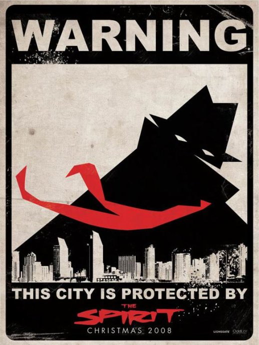
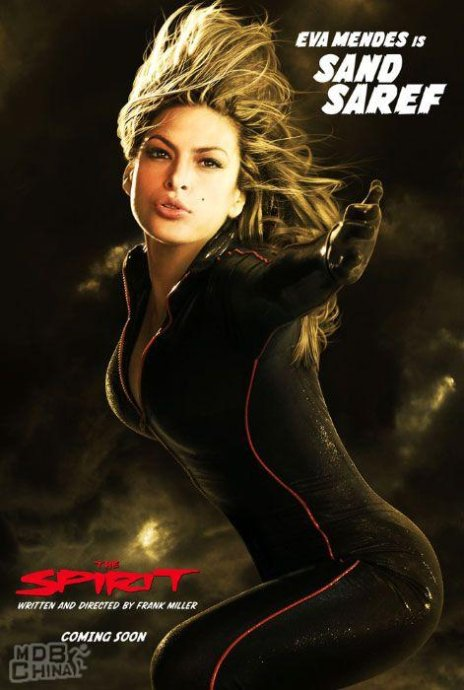
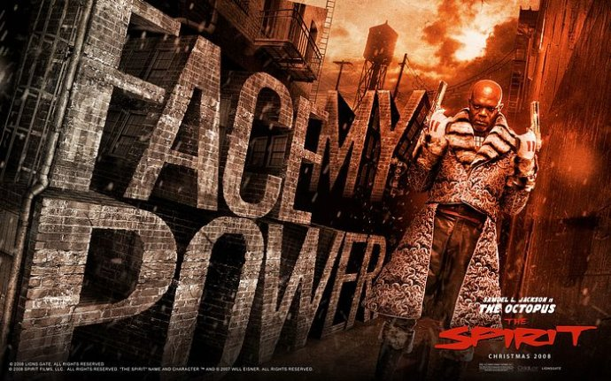

《闪灵侠 The Spirit》

			

老公的评论：
 
　　看这部电影最高兴的一点，莫过于见到《灵书妙探》中的Beckett，她是近期最喜爱的欧美剧女性角色。
 
　　至于电影本身，不过是漫画英雄的一员，没有什么好，也没有什么不好，黑白画面中飘起的红色领带，够酷。
 

　　这部电影很像《罪恶之城》，但是感觉却比《罪恶之城》更卡通一些，比如章鱼和闪灵侠怎么互殴都死不了，好玩，但是略微的有一些过于神化，对于不死的好人和坏人来说，整部电影就像牛皮糖了。
 

　　主人公的脸一直就没怎么看清楚，对于这个故事的剧情，我只能说我的接受度确实要低一些，这就是文化的差异吧，中国文化与西方文化肯定是存在差异的，就是这样。

老婆的评论：
 
　　这部电影给我最大的感觉是拍摄的风格和《罪恶之城》非常的像。
 

　　漫画角色好塑造，不用逻辑性强，只要是大家喜欢的英雄就行。‘幽灵’就是这样的一个英雄，他不仅维护着这个城市的治安，还有给他塑造了一个死对头，一样的拥有不死身的‘章鱼’，整体来说这个大坏蛋‘章鱼’貌似还没搞各种破坏，没有其他漫画片中的坏人坏。我被‘章鱼’及他助理爱来一段段的角色扮演挺搞笑的。
 

　　在看这部影片时，看着看着有种被催眠的昏昏欲睡，可能是因为节奏慢，可能是因为对白多，可能是因为情节不够激烈，再有可能不够打不够刺激，呵呵，反正是没让我全神贯注。
 
　　遗憾的是影片都结束了，也没看到男主人公的全貌，应该是一个帅哥。这影片中的女影星一个个都挺漂亮的，很养眼。

上映年份：2008							
		
http://blog.sina.com.cn/s/blog_52187ba9010122om.html
