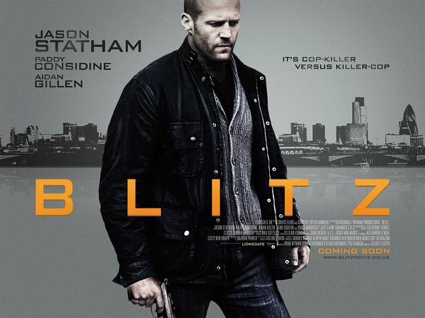

《闪电 Blitz》

			

老公的评论：
 

　　因为是斯坦森主演，所以必须要看，开头让人很振奋，暴力正义总是有看点的，但是随着剧情的发展，发现这是一部英国电影，和我们所熟悉斯坦森的电影还是有一些差别的。
 

　　最大的差别就在于闷，这部电影剧情很流畅，但是除了结尾之外，缺乏必然的看点，比如那个吸毒的女警察，不知道演她的目的是什么，还有那个帮助斯坦森用电脑的女警，老婆大人说看他很眼熟，但我却不知道她出现在这部电影的目的是什么。
 

　　我说了，是除了结尾之外，缺乏看点，但是如果算上结尾的话，这部电影被我打的分数要高了许多。这样的结尾太解气了，虽然有些在意料之中，谁都会想到斯坦森会用自己的方式去惩罚罪恶，但是谁能想到他们处理的如此完美呢！
 
　　结尾怎么样，呵呵，恕不剧透！
 
　　斯坦森迷不要错过，喜欢暴力正义、地下法官的也不要错过啊！
 
老婆的评论：
 
　　喜欢斯坦森演的电影。
 

　　这部影片过程挺枯燥的，以绰号“闪电”的人不断杀死警察为线索，警官布兰特（斯坦森饰）与搭档要尽快找到凶手防止他在杀同事。哦，斯坦森在这部影片中的警察形象有的狠。
 

　　其实这一过程一点都不出彩，布兰特不断嘲笑他的同性恋搭档也不幽默，侦破的过程也相当的枯燥，而且他们甚至比一名无所事事的小混混还慢找到真相。而斯坦森的功夫戏也很少，硬汉形象也似乎塑造的不够好。
 

　　但电影的结尾，我和老公都喜欢，简直是太棒了，布兰特与搭档做局把闪电给杀了，很让人解气，嚣张变态的坏人终要得到应有的惩罚。
 
上映年份
2011							
		
http://blog.sina.com.cn/s/blog_52187ba90100w3yz.html
