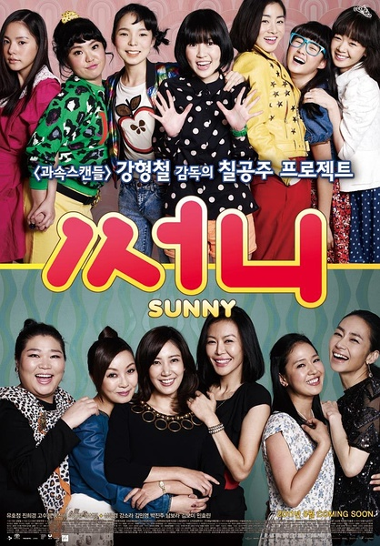
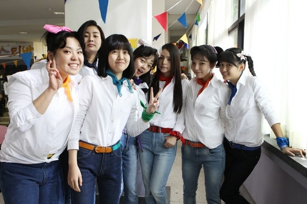
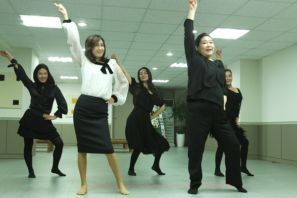

《阳光姐妹淘》

			

老公的评论：

　　这部电影一开始的节奏有点慢，后来开始渐入佳境，越接近结尾的部分越好看……

　　没有什么主题，没有什么立意，虽然是讲少年伙伴中年相逢的故事，但是并没有太多直接的关联，故事中的“七姐妹”已经有25年不联络了，再见面大家都已经有了完全自我的生活。

　　我没法说我懂得女人，特别是未成年女性的感情世界，无论是她们和家人的感情，和闺蜜的感情还是对异性的感情，我都无法懂得，这一点让我看这部电影没法太投入，不过搞笑这一点我还是看懂了。

　　故事虽然也是用“死亡”来制造反差，来博人笑哭的，但是最终还是个喜剧结尾，这点算是做的不错。

　　不明白电影中的女校学生怎么都像“古惑女”，难道现在的学校也是这样？不过看看网络上的新闻，还真有可能如此，世界这么可怕，我该何去何从呢？

　　除了剧情很冷幽默以外，剧中的主题曲很好听，几个小主人公跳的舞也很不错，真的很佩服韩国人在娱乐方面的开拓精神。

　　四年前的电影，有点旧了，但是正是时下流行的题材。

老婆的评论：

　　简单来说，这部电影就是寻找和追忆。

　　电影由两部分组成，一部分是成年的Sunny成员任娜美遇到了正在医院治疗的队长夏春花，只剩下两个月命的夏春花提出想看看其他的人，任娜美的寻找之旅，感觉上也是她们自我救赎之旅。另一部分就是追忆当年Sunny是如何组成的，成员郑秀智受伤后的消失，成为她们的遗憾。

　　人总会在面临死亡，才会展开对人生思考，你的梦想在哪里？现在当家庭主妇的任娜美原来有过很多理想……

　　这部电影里任娜美、夏春花、金玫瑰、黄珍熙四人去揍欺负任娜美女儿的学生，很有意思，真逗！

　　最后为夏春花跳的那段舞，还真是，虽然大家是带着笑跳的，但是让人心酸啊。

　　这部电影刚开始的时候节奏慢，但后来的剧情推进的不错，是一部不错的电影。

上映年份 2014							
		
http://blog.sina.com.cn/s/blog_52187ba90102vqj2.html
