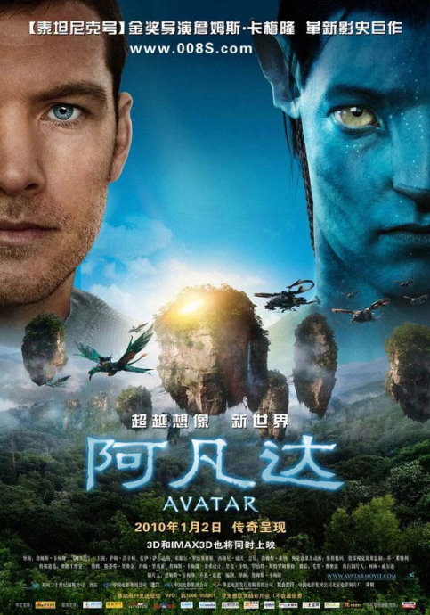
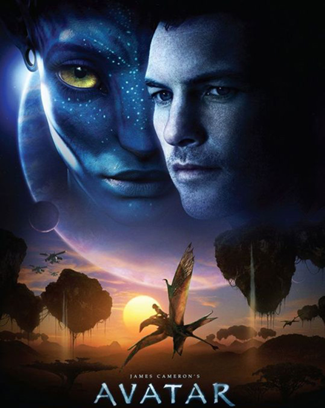
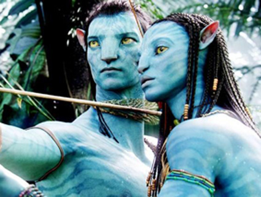

《阿凡达 Avatar》

			【夫妻影评】《阿凡达 Avatar》

老公的评论：
 
　　第一，我觉得这是一部关于美国人与印第安人打仗的科幻版电影。
　　第二，我觉得导演有印第安血统，所以纳美赢了。
　　第三，电影中的外星景象实在是太神奇了，让我非常向往。
　　第四，总感觉纳美人的胜利是阶段性的，当俘虏回到地球之后，等待纳美人的将会是更加惨烈的屠杀……
 

　　我很是陶醉于这部电影中关于外星生物的描写，那种像犀牛与锤头鲨结合体的怪物，在空气中飞翔的“水母”，长了六条腿的“老虎”，还有那些像翼龙的“坐骑”，长了个膜鼻子的战马，旋转飞舞的昆虫，会发光的植物……，如果只挑一点来描述这部电影的成功之处的话，我选这些关于外星景物，太酷了，这才是人们想要了解的世界！没道理地外行星就都是沙漠吧！
 
　　这是一部视觉冲击力很强的电影，看的就是炫和酷，关于剧情，其实它到没有什么特别创新的地方。
 
　　或者，我们该想想现在的地球吧，海啸、地震的频繁爆发，是不是大自然也在试图告诉我们什么呢？
 
　　这个电影，适合看，不适合说，所以，就不多写了……
 

 
老婆的评论：
 
　　终于看到了这部影片，确实如传说中那么精彩，感觉很久都没看过这种大片了，我喜欢！
 

　　从电影的制作方面来看，这是我想要看的，外星就应该有所不同，那个世界的生物和种族都应该是不同的。喜欢电影里面的纳美人可以骑终极魅影，喜欢满地的植物发出亮丽的光，制造出一个梦幻的世界。喜欢很多很多关于这部电影的小细节，很享受的视觉效果。
 

　　从电影的情节设计来看，我觉得把地球人和纳美人的冲突也制造的很好，正是因为这种明显的冲突，让我觉得一定要支持纳美人战胜地球人，因为地球人太贪婪了，为了财富，去侵占人家的地盘，毁坏这个梦幻的世界，我早就希望那个将军死，感觉他才是最大的坏蛋。在两个种族的战争中，我们很不希望保护纳美族的人类死去，尤其是那个女飞行员，在之后的战争中感觉纳美族就要输了的时候，老公说除非大自然站出来，结果奇迹真的出现了，锤头雷兽及迅雷翼兽都出来了，纳美族的保卫战终于胜利了。
 

　　从电影的另一条情节来说，地球人杰克与纳美族公主的爱情故事，对于地球人来说，思想上爱上一个与自己不同的人，其实有点困难，但对于杰克来说，其实也应该是一种解脱，他本身是个残疾，在另一个世界中，他是神奇的。最终他留在了这个星球，并真正的变成了纳美族人。我在想，如果是我的话，我能否接受这种异类的爱恋，没答案。
 
　　还想提一下，我觉得纳美人辫子中的那些须能同生物链接，这一点很有意思。
 
　　总的来说，是一部很好看的电影，值得一看。
 

							
		
http://blog.sina.com.cn/s/blog_52187ba90100gmxe.html
