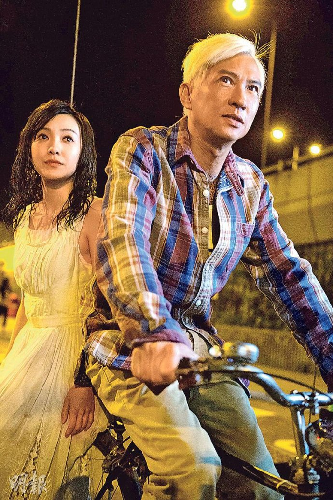
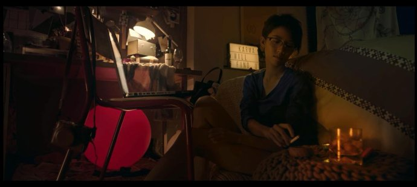

《陀地驱魔人》

			

老公的评论：

　　本来觉得前两天看过的《树大招风》已经算是很不错的港片了，没想到这部《陀地驱魔人》更符合我们的口味。

　　选择这部电影的初衷，是希望看到一部好看的灵异恐怖片，但是没想到这部电影不但一点都不恐怖，而且还是一部爱情片，而且居然还很好看……

　　这部电影里出现的演员基本都是我们喜欢的，张家辉就不用说了，在他拍喜剧片的年代，我甚至认为香港喜剧片的风格是沿着梁朝伟、周星驰、张家辉的脉络延续的；张继聪也是最近TVB中我们比较喜欢的演员之一，他虽然模样不帅，但是演技很棒，演什么像什么；蔡思贝算是个半新人吧，TVB的电视剧最近她主演了不少，虽然整体形象缺乏变化，但还算是可以被接受……；剩下的还有很多熟脸儿就不用说了；倒是郭采洁，虽然因为那个广告认识了她，但是并没有怎么看过她的电影电视剧。

　　这部电影给我最深的感触就是驱魔人的孤独，到底是多么孤独的人，才会想到和鬼做朋友，才会爱上一个鬼……，我想，只有在某个领域达到顶峰以致常人无法理解，才能感受这种深深的孤独吧。主人公虽然很酷，但是从寂寞的角度来看，他也很可怜。

　　至于影片中的捉鬼、灵异、阴间，其实真的没有那么可怕，真的不如主人公的爱情那么让人有感觉。

　　不知道片子的结尾是什么意思，是在为下一部做铺垫吗？华语电影有这么好的题材，怎么不拍成电视剧呢？期待期待！

老婆的评论：

　　我以为这部电影主要想讲的故事就是人鬼情未了。那些抓鬼情节完全是为了丰满这部爱情电影，让他与其他的爱情故事不同。

　　整体来说，我觉得这部电影挺好看的。

　　黄永发（张家辉饰）是一个驱魔人，他有一双阴阳眼，能看到正常人不能看到的另一个空间的鬼魂们，那些游走的鬼魂因某种原因还未去投胎，有的就会附身到人的身上来作怪，黄永发干的就是驱逐那些上人身作怪的鬼。在他家住着一个女鬼江雪（郭采洁饰），很小的时候江雪就在他的身边陪着他，不知不觉的他们俩相爱了，送江雪去投胎那段离别，黄永发的表白多深情。

　　黄永发的好友阿葱（张继聪饰）跟着他去驱鬼拍下视频分享出去，引起了狗仔队记者紫宁（蔡思贝饰）的好奇。真是好奇能害死猫，紫宁就差点被附身的鬼害死了。之后他们一起解决恶鬼黑哥（释延能饰）的事。

　　结尾出来的那个没有眼睛的鬼是什么意思？他再等黄永发跳楼吗？那么黄永发会不会跳下去呢？

　　最后我想说的是，我能喜欢这部电影塑造的鬼世界，很清楚的表现出，人与鬼既能相互交集又能在各自空间独立，这种感觉完全拍出来了。

上映年份：2015年份							
		
http://blog.sina.com.cn/s/blog_52187ba90102x8rp.html
