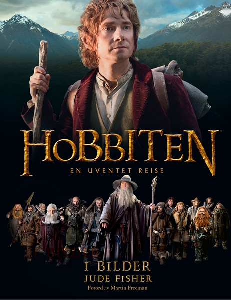
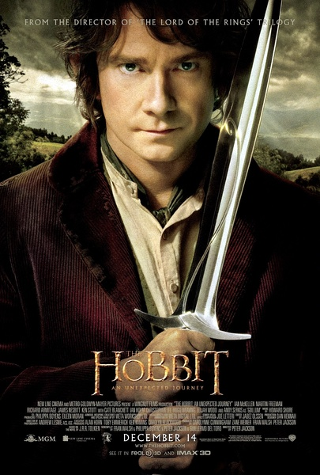
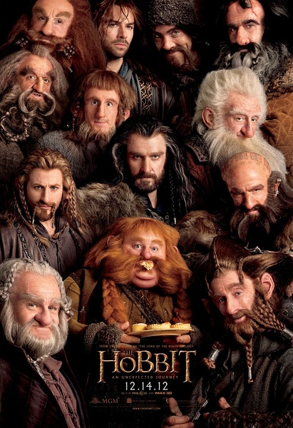

《霍比特人：不可思议之旅 The Hobbit: An Unexpected Journey

			

老公的评论

 
　　这种中世纪感觉，有剑与魔法的影视作品总是老婆大人的心头好，我没她那么喜欢了。
 
　　说到不喜欢，其实我们两个是连魔戒都没看过的，总是在想看的时候错过机会，所以看这部电影的时候，总有一些连接不上的地方。
 

　　我觉得《霍比特人：不可思议之旅》是和《阿凡达》一类的片子，是一个真人参与演出的动画片，场面够好看就行了，至于故事情节，真的不是那么重要。
 

　　和西方的文化差异让我有的时候不是百分之百理解西方人的文艺作品，但同时文化差异又让剑与魔法塑造的世界给我们不同的震撼，同样来自于神话，但是西方的妖怪总是和我们本土的妖怪不一样一些，没有谁好谁坏之分，但是看妖怪吗，就是要够妖够怪，新的妖怪总是要更有诱惑力一些了。
 

　　和老婆大人一起看电影、一起讨论，总是能在《魔法门之英雄无敌》里找到一些妖怪的影子，这恐怕也是老婆大人爱玩这个游戏的原因。

老婆的评论：
 

　　好故事是要修饰的，这部电影虽说展开情节时也有点慢，但在这个过程中，用了半兽人，精灵族，有要把矮人们吃掉的石头人，洞穴怪们及几座石头山打架这些修饰，让这个故事显得丰满生动起来了。
 
　　我们在看的过程中，一直把这里出场的怪物们，与游戏英雄无敌三里面的小怪们做比较，有的还真能对上座。
 

　　目前看霍比特人还没有发挥出他应该有的作用，如果这是系列三部曲，冒险的旅程现在才算是真正的开始了，要历经什么样的磨难才能让矮人们回到自己的家，只能等着看接下来的两部了。
 
　　我喜欢这部电影中制作出来的怪物们，我觉得很形象。

13个勇敢的小矮人
上映年份 2013							
		
http://blog.sina.com.cn/s/blog_52187ba901019l4l.html
