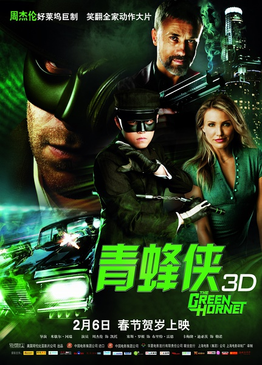
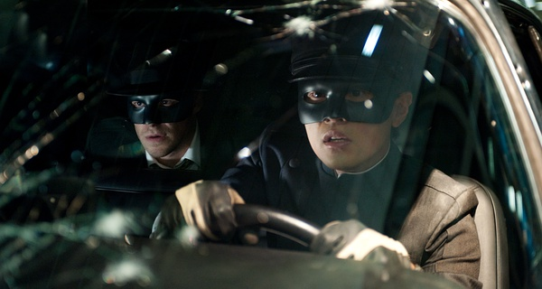
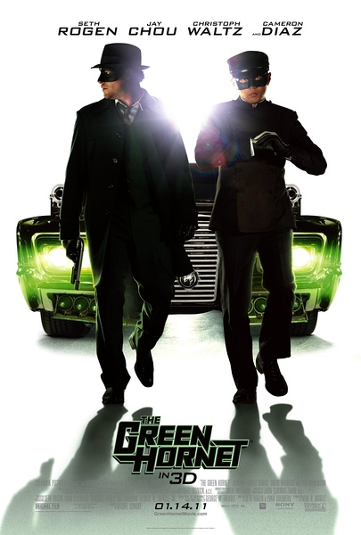

《青蜂侠 The Green Hornet》

			

老公的评论：
 
　　一直没觉得周杰伦能够演出好看的电影，理由是他太本色了。看过之后，感觉和我想的一样，周杰伦演言情片或者动作片或者喜剧片，角色的差异不会太大，真的是因为他很本色。

 
　　我觉得周杰伦不该放弃他的风格，正是这种本色，成就了他今天的辉煌。
 
　　说的剧情，我觉得我看的版本电影剪接的有一些问题，很多剧情显得很唐突，很多台词对不上，比如我一直没闹清楚为什么一个出生在上海的人会起一个日本名字……

 
　　感觉上这部电影很像是B级片的制作水准，并没有什么真正精彩的场景，可拍这种英雄题材的电影，没有电特效怎么行呢！让我眼前一亮的镜头只有一个，就是那道由汽车伪装的围墙大门，那一瞬间显得确实够酷。

 
　　或许是文化的原因吧，我觉得这部影片并没有反应出我很在乎的孝道，这在我看来很不可思议，我想我是一个很传统的人吧，没法去接受一个人肆意地攻击自己的父亲，甚至是把父亲雕像的头给摘下来，这点我真的接受不了，甚至看到这个时候我几乎有放弃这部电影的想法，我觉得这不是搞笑，是混蛋，而且是混蛋加三级。

 
　　呵呵，不过看电影就是看个乐儿，也不用在乎太多，看完了，就表示我陪着电影的这段时间过得还不错！ 

 

老婆的评论：
 
　　看完这部影片后，我去网上看了一下网友对这部影片的评价，大部分的观点都聚焦在周杰伦上，个人觉得这样的话失去了看这部影片的意义了。

 
　　客观的来说，在众多漫画英雄影片中，这部影片看完的确没有什么值得眼前一亮的东西。不管是演员的阵容，还是剧情的发展，还是电影中的道具特技，给人的感觉只是一般一般。

 
　　演员阵容，主演塞斯罗根，长相只有一般吧，还演一个整天无所事事，话却一直说个没完的英雄，看完后怎么也谈不上喜欢。在我的感觉中，英雄话必定话不多，有深度，能打，这次的青蜂侠一样的取不了。相比之下周杰伦的表现就要比他强，至少一个特别的本领，把战车改的极其厉害，拳脚功夫也似模似样，穿上行头到也过的去。卡梅隆迪亚茨，就太老了，戏也不多，没什么可说的。

 
　　剧情方面，一部改编漫画英雄的电视作品，剧情往往很简单，就是青蜂侠最终战胜不可一世的敌人，这点倒是没有什么问题，我的感觉是英雄与坏人冲突可以再明显点，在激烈一点。

 
　　至于人物形象及道具特技这块，我觉得是这部影片最大的败笔，这部电影中的青蜂侠这个角色的塑造上，除了有钱，我再也找不到该片中这位青蜂侠那点符合英雄的特质。在漫画改编的影视作品中，道具都相当的酷，随着近年来，很多影片在道具特技这块大下功夫，这部影片中让人记得的东西实在是太少了。

							
		
http://blog.sina.com.cn/s/blog_52187ba901017hap.html
