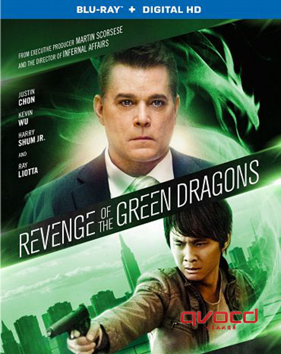
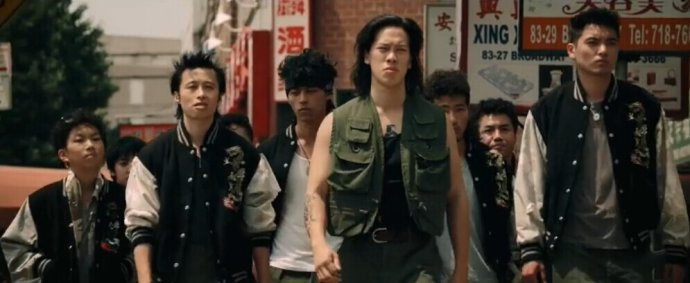
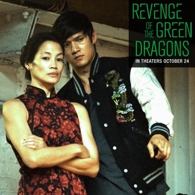

《青龙复仇 Revenge of the Green Dragons》

			

老公的评论：

　　一时间，很难给这部电影做一个明确的分类，算动作吗？枪战……？甚至我都没法定义这部电影好看与否，说好看，我觉得片子太沉重了，而且故事没有主题，说不好看，在紧张紧凑的情节中我们也把这部电影看完了，奇怪的感觉！

　　首先要说的是这部电影的结局太黑暗了，呵呵，还是很喜欢欧阳靖这个演员的，他在TVB中的出演很搞笑。不过这次他居然是个黑警，恐怖！

　　故事中的保罗也很另类，到底是个什么样的人呢？最后的片尾为什么要说他没有被审判呢？难道他才是真正的卧底？那么欧阳靖扮演的警察不是黑警？

　　因为结尾，整个故事都被搞乱了。而且剧情中的画外音也挺有意思的，如果主人公死了，那么怎么能用回忆的方式来拍这部电影呢……？

　　有些没看懂……

老婆的评论：

　　这部电影想说明什么呢？那些偷渡到美国的人生活的并不好吗？或许只是改编了一个真实故事而已，属于记录片，并不想说明什么。

　　桑尼和史蒂芬很小的时候被家长带着偷渡到美国，在唐人街开始新生活，无意中史蒂芬遇到了青龙帮，然后带着桑尼加入了青龙帮，在这么一个弱肉强食的世界，史蒂芬很当然崇拜青龙帮那些男人，由此看来小朋友人生道路没有正确的指引是不行的。

　　不明白为什么史蒂芬后来会变得那么暴力？他好像失控了，结果被青龙帮自己人给处理了，这给他的好朋友桑尼带来了很大的刺激，再加上桑尼的女友被青龙帮的老大保罗杀了，导致桑尼找到了警察唐。

　　我想这个世界上大多数人都是可以被收买的，只要给足够多的诱惑，唐应该就是被保罗收买了，最后还杀了桑尼，这样看真实里保罗能跑了，也是正常的。

　　整体来说，我不是很喜欢这部电影。还好看到了欧阳靖这个熟脸孔，算是一种补充吧。

上映年份 2014							
		
http://blog.sina.com.cn/s/blog_52187ba90102vtai.html
