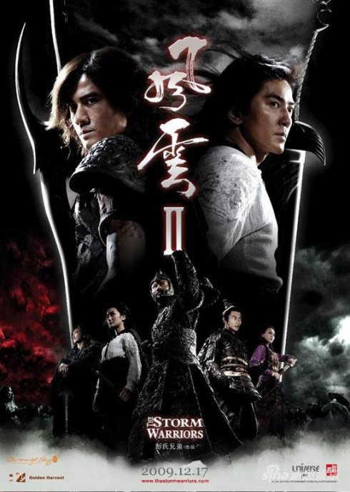
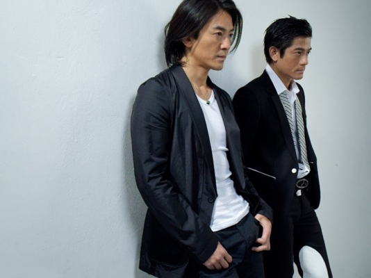

《风云2》

			【夫妻影评】《风云2》

老公的评论：
 

　　我相信在很多年轻人看来，郭富城与郑伊健都已经过气了，他们的辉煌基本停留在了上个世纪。对于郑伊健，可能我的感觉还淡漠一些，毕竟《古惑仔》开始发行的时候我已经上大学了；而郭富城绝对是我曾经非常喜欢的娱乐圈中人。
 

　　好久没看郭富城的电影了，忽然想起前不久收拾搬家前从老房子带来的一些物品，有我小学的三好学生奖状、有中学的录取通知书，居然还找到了很多郭富城的不干胶，很久了，但似乎又很清晰地就在眼前。
 

　　人总会长大，电影电视剧也总会推陈出新，但是很明显，《风云2》 虽然更新一些，但也更无趣一些——当然，除非你是非常酷爱电脑特效的那一群人，因为这部电影看得就是耍酷的特效。
 

　　《风云》的漫画我没有看过，但我看过《风云》的小说，看过赵文卓、何润东版本的电视剧，怎么看，都比这部电影要好一些。个人感觉，这部电影没有对白是谁都看的出来的，更重要的是没有什么情节——绝无神那么厉害的角色，居然被步惊云和聂风在不经意间就打败了，好像太快了吧。
 

　　既然坚持着看完了，还是保持我们的风格，多谈谈积极的一面吧。在这部电影里，郭富城的造型真的不错，让我完全可以忘记了他的年纪，何家劲也很有派，我觉得他的长发看起来要比郑伊健的帅多了。再有就是那些武功特效，太酷了，说起来，这样的特效才是武侠影片应该有的特效，很过瘾，虽然知道都是后期制作的，但是看着很有感觉。
 
　　谢霆锋在片子里的角色很有趣，我完全没有看懂除了因为原著里有这么一个人物外，这个角色在电影中到底有什么作用或者价值……
 
　　一部可看可不看的电影，除此无他！
 

 
老婆的评论：
 
　　最近看了很多的电影，令我们失望的不多，这部电影总算弥补了这点，差点就看不下去。这些演员们对白再少点，就赶上演默剧了。
 

　　应该说这些演员郑伊健、郭富城、谢霆锋包括任达华都是我们比较喜欢的演员，他们也算的算是巨星了吧，可惜这部电影一点都不出彩，武功再酷一点，特技效果再好一点，再多点大腕也拯救不了这部电影剧情的空白。
 

　　很难想象的到，电影能拍成这样，至今我还想不明白，如果绝无神（任达华饰）的出场是为了让聂风（郑伊健饰）入魔，那么绝心（谢霆锋饰）的出场又是为了什么？第二梦（阿SA饰）的出场呢？不是为了化解聂风的入魔？那干嘛还要这个角色。整个电影交代的不清不楚，既然无名、风、云、猪皇这么厉害，干嘛一上来就被抓了？又是谁给他们解药的？风云既然是兄弟，最后对决怎么成了他们俩了？绝无神这么厉害风云学几天怎么可以打败他呢？绝无神的组织怎么样了？皇帝该怎么处理聂风？
 

　　这部电影也不是一无是处，至少特技效果不错，有点漫画的风格。还让我回顾了一次《风云》电视剧，个人认为要是电影在剧情方面稍稍的向电视剧靠齐一下，电影就会大不同，聂风在变魔后性情大变之时要杀第二梦，关键时候觉醒。与步惊云一起决战绝无神，可以打个你死我活的，既能显示绝无神的厉害，又能显示风云组合同心合力的威力，这才是《风云》的魂，电影给我们的是什么？是风云决个你死我活，步惊云还要为聂风掉下悬崖不知生死，电影把魂给丢了，又怎么会好看呢？

上映年份2009							
		
http://blog.sina.com.cn/s/blog_52187ba90100oyip.html
