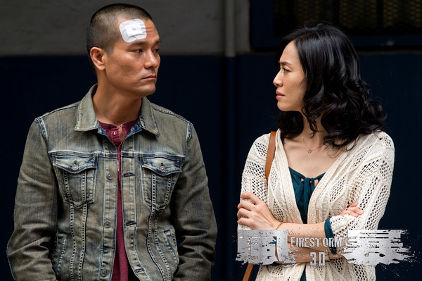

《风暴》

			

老公的评论：
 
　　很久没有看到港产的“大片”了，《风暴》绝对是一部！
 
　　说它是大片，不是因为里面有刘德华、吕良伟、林家栋……，而是因为这部电影的视觉冲击力够大，够颠覆。
 

　　华语电影因为要审核的比较严格，所以很少有“暴力破坏城市”的场景出现，在这部电影中，在香港居然发生了规模如此大的“枪战”，厉害！我一直在想，如果我刚好在旅游的时候遇到了这样的场景，会不会偷偷地看呢？
 
　　地下煤气管道的爆炸让片子的结尾部分有一些“灾难片”的感觉，真的是山崩地裂，明知道是特效做的，但是觉得欣赏起来很刺激。
 

　　片子的结尾主人公也陷入了囹圄之中，这样让整个故事更完整了，毕竟他也是做错了一些事情的，这个故事的结尾好像是说：哪怕你是恶人，如果做了好事，也会有一些好报；哪怕你是好人，做了一些恶事，也会有一些报应……
 
　　梁烈唯、黄智雯、王君馨……，这些角色都出现了，有意思，有意思！

老婆的评论：
 
　　在最近我看的港片中这部是最有气魄的，场面够大，特效的感觉也很好。
 

　　这部电影，刘德华演的警察真的已经是过界了，所以，结尾把他抓起来，算这部电影比较有交代。虽然我很喜欢这种对坏人凶狠的警察，但他的确做错了。
 
　　现在的坏人也需要实力，看看这部电影里的坏人，枪火绝对比警察的强，没有实力只能做小贼了。
 

　　其实有一点我不太想得通，坏人有这样的装备，为什么不抢一次大的，然后消失，这样还不容易被抓，而且他们已经抢了辆押款车，应该能花段时间了，干吗这么着急又干一票呢。
 

　　卧底不好干，搞不好还会连累孩子，所以，这两个卧底最后都死了。当然，这部电影死的人很多，场面也很惨烈，这样的话，卧底就不算什么了。
 
　　总体来说，这是一部好看的电影。

                                        
场面很惨烈

                             
林家栋也老了，还是演文征明时有意思
上映年份　2013							
		
http://blog.sina.com.cn/s/blog_52187ba90101fuqe.html
