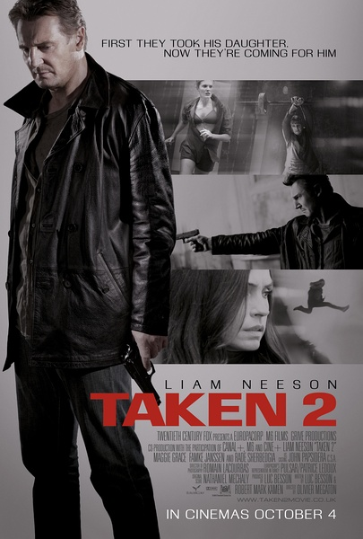
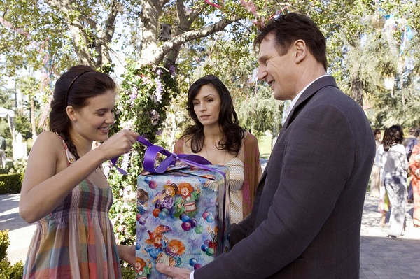
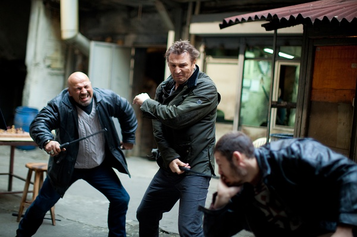
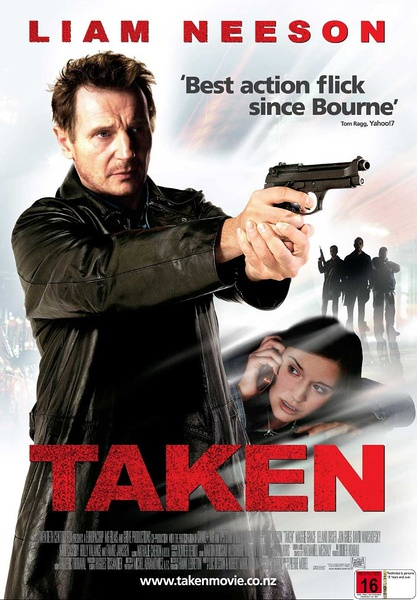

《飓风营救 1-2 Taken》

			

老公的评论
 
　　因为不怎么喜欢《辛德勒名单》，所以对利亚姆·尼森并没有什么深刻的印象，不过两部系列电影却一下子让我记住了他的形象。
 

　　对于《飓风营救》，我能用的最好的形容词就是“痛快”，主人公做事干净利落，对坏人绝不留情，能杀死的绝不打伤，这一点省去了很多婆妈的情节，不过觉得他把那个法国人的老婆给打伤有一点过了，那个女人毕竟是无辜的。
 

　　以一个人对抗一个组织，这种剧情通常是属于史泰龙或者施瓦辛格的，《飓风营救》带给了我全新的感觉，看完了前两部，我在想第三部会怎么拍，还是要和阿尔巴尼亚人开战吗？主人公在欧洲各国惹事，怎么还能如此逍遥法外呢？或许这都是下一部需要讲述的内容吧。
 
　　其实一直期待主人公的几个挚友会参加到他的营救行动当中，那样会更激烈也更富于变化。
 

　　两部电影给了我们一个大团圆的结局，最后如果主人公一家三口都在一起的话，我很喜欢。哈，最好第三部他的女儿KIM也被训练成一个特工，那就过瘾了。

老婆的评论：
 

　　这两部电影不错，很精彩，很过瘾。相对而言第一部比第二部更精彩，原因是救女儿凯姆如救火，在完全不知道女儿在哪里的情况相下要找到并救出，苦了布莱恩了，不过他真的很冷静沉着，做事很有策略，第二部至少情况比较明朗一些。
 

　　所以绑架这种事情也是有风险的，就像这部电影似的，就因为绑错了凯姆，导致整个帮派都被灭了，结论无论做哪一行，信息工作一定要做好，先调查一下绑架对象的家长是不是特工？或者这个帮派不要为了节约运费这项成本，还是应该把这么有风险的事情离自己远点干。
 
　　看电影时，我就和老公说，他有的地方很像布莱恩，小心谨慎。呵呵，这样看其实也很好。
 
　　将来我们要是有了孩子，是不是也很不听话啊？老公，你要加油啊！……

动作干净利索，对坏人一点都不留情
上映年份 第一部 2008

        
第二部 2012

							
		
http://blog.sina.com.cn/s/blog_52187ba901019wjb.html
