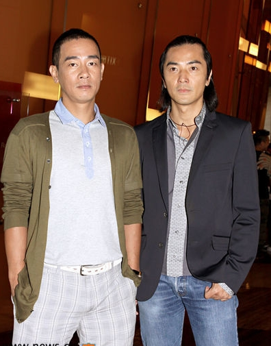

《飞砂风中转》

			【夫妻影评】《飞砂风中转》

老公的评论：
 

　　我想，我这个年代长大的人，还是会很怀念郑伊健和陈小春同台演出的，在上个世纪的九十年代，他们两个人绝对是我们这代人的偶像，也正是因为这个原因，我才找来这个电影和老婆重新温习一下年轻的感觉，谁知道，事情并不是这样。
 
　　很多人觉得这个电影颇有一些黑色幽默，我想我是不大懂得的，我觉得幽默就是幽默，干吗要庸人自扰，非得分出个黑白来呢。
 

　　从这个电影，其实可以看出很多香港老电影的感觉来，片子中的一切都是在恶搞，本以为经历了低谷之后，香港电影会有一些突破，结果还是停留在了原地不动。
 

　　所以，我在想，一直以来，被影迷们认为的香港电影的低谷根本就不存在，香港电影其实就是这种状态，我们觉得他们的电影不好看了，不精彩了，只是因为随着互联网的发达让我们有了更多的比较。
 

　　突破真的很难，创造真的很难，文化的传承其实却不难。香港电影，想寻求变化，还是应该多注重文化方面的内涵，要不，辜负了那帮在人们心中已经塑造了绚烂形象的演员。
 
　　比起来，我觉得香港的电视剧做的就好的多，难道，这才是趋势？
 

老婆的评论：
 
　　一部奇怪的电影，另一个感觉有的场景比较傻，算是故意搞笑吧。
 

　　没想过电影中的卧底能当成这样，身上穿着香港警察的背心，警局的海报上有他的相片，黑社会故意不拆穿他的身份，还利用他给警方假消息，这个卧底可真够傻的，还好是跟了一个傻大哥，傻大哥也够傻的，黑社会所有人都知道卧底在他身边，只有他自己不知道，最后被他的小弟抓了，还来了一段：“对不起，我是警察。”无间道的台词。
 

　　正常黑社会里的人为了当老大打破头，这里的火腩（陈小春饰）与燕子文（郑伊健饰）为了不当老大绞尽脑汁，真不容易啊！一个是为了开餐厅和家人开心的生活在一起，另一个是为了上香港大学。
 
　　郑伊健及陈小春都显老态了，尤其是郑伊健。
 
　　叶璇在这部影片中的表现很一般。倒是余安安演的很是疯癫，查了一下，才知道原来她是周润发的前妻，当年她也很火的。
 
上映年份
2010							
		
http://blog.sina.com.cn/s/blog_52187ba90100nea9.html
