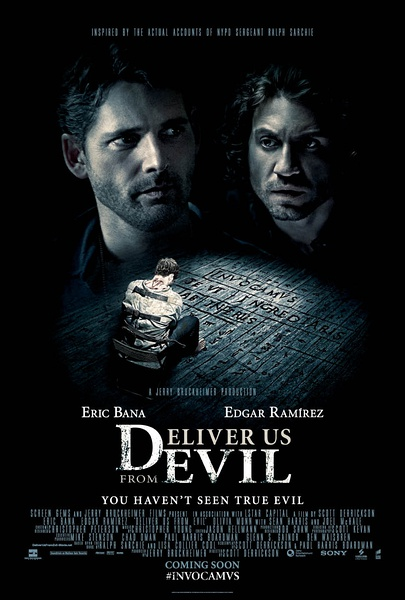
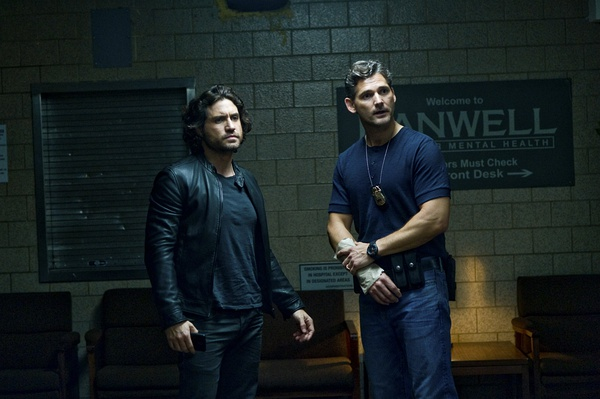
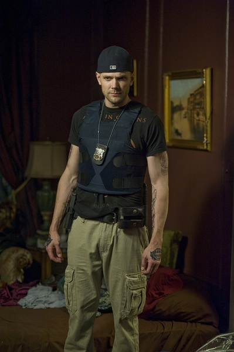
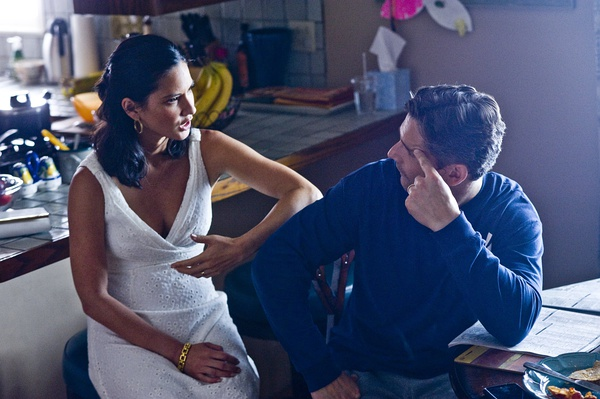

《驱魔警探 Beware the Night》

			

老公的评论：

　　只是一部和宗教有些关系的电影，不过我从中看到的，更多的是做人的道理——要敢于面对自己的错误——不过这一点好像和电影的内容没有什么必要的关联。

　　从《邪恶力量》开始，我们了解了，并且真的喜欢上了关于西方传说的灵异故事，恶魔是经常出现的电影话题，驱魔当然也是必须的了。

　　这部电影没有我看到片名时候想象的那么好看，感觉上不是一部大成本的电影，里面的桥段也不是很创新，不过片子的连贯性很强，虽然没有绝对超越其他的地方，但是一气呵成地看下来，也不觉得没意思。

　　这部片子的女主角是《新闻编辑室》的老熟人，这让我和老婆大人又兴奋了一下。

老婆的评论：

　　这是一部关于宗教信仰的影片，最终告诉你，一定要勇于面对自己的问题。

　　影片大部分时间是在晚上进行的，这个风格不是我们所喜欢的，很奇怪这部影片我们居然看完了。

　　大部分时候，我觉得这部电影更像恐怖片，大晚上的没有灯，忽然出现一个死人，恶狗，太让我心惊胆跳了。

　　从这部影片中，我们应该知道很多黑暗的地方不要去，谁知道会被粘上什么呢？

　　额，又找到一个熟人了奥立薇娅·玛恩，但没想起来她在哪里演过，后来查资料才知道是之前看的《新闻编辑室》。

　　恶魔被驱逐了，萨奇警官最后和牧师搭伙才驱魔小组了吧。

　巴特勒死的很可惜。

看见熟人奥立薇娅·玛恩演过《新闻编辑室》
上映年份 2014							
		
http://blog.sina.com.cn/s/blog_52187ba90102vdoz.html
