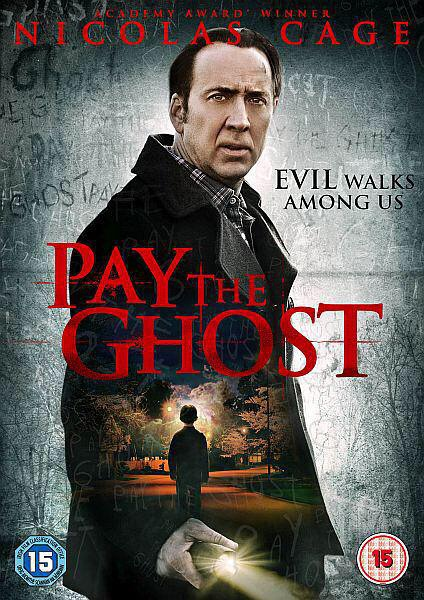
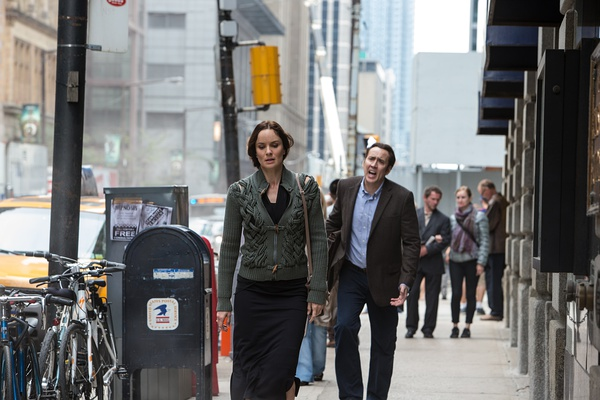

《鬼债 Pay The Ghost》

			

老公的评论：
 

 　　本来，灵异题材是我们两个最喜欢的，但是这部电影之中虽然有灵异的剧情，却更像是一部生活伦理片。
 

　　凯奇是一个让人可以信服的演员，在这部电影之中的演出也很不错，不过说实话，这部电影的节奏有些偏慢，在开始的前二十分钟，有几次我都想放弃了。
 

　　其实，对于剧情，我更关心的是小朋友查理如何面对从灵异空间回到现实世界，他凭空少了一年的记忆，周围的同学会怎么对待他？他还能继续上学吗？
 

　　还有就是万圣节，我也一直觉得西方的这个节日很有趣，通常来说，小朋友都是害怕鬼怪的，但是在这一天，他们却喜欢装扮成鬼怪，而且还很高兴，快乐也许是减少恐惧的好方法吧。
 
　　这部电影真的没有展现出凯奇的风采，希望能看到他的更精彩的大片！

老婆的评论：
 

　　在我看来这部电影更像一部生活伦理片，就是男主人公麦克·科尔（尼古拉斯·凯奇饰）在万圣节把儿子给弄丢了，和妻子寻找儿子的故事，只是加了一些鬼的身影。
 

　　在麦克心酸艰苦的寻找儿子时，有些莫名其妙的信息出现了，他找到分居的妻子那，也一样的有情况出现，最终他在鬼屋里找到了那个失踪的儿子，也算是难得。可因为这个还是害死了别人，估计以后也会有心理负担。
 

　　其实又是一部复仇的影片，很多年的一个妇人家的三个孩子被烧死了，她发誓要复仇，那鬼屋里那么多孩子的鬼魂，可见害死了不少孩子。
 
　　看完这部电影，让我真心的希望那些人贩子不要再偷小孩，好好的家庭都会被折磨成什么样了，哎！
 
　　整体来说，这部影片不是很好看，可以不看的。

上映年份　2015							
		
http://blog.sina.com.cn/s/blog_52187ba90102w67n.html
