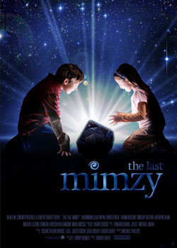

《魔力玩具盒 The Last Mimzy》

			【夫妻影评】《魔力玩具盒 The Last Mimzy》

老公的评论：
 
　　首先，我真的觉得这部电影是科幻和通话完美的结合体。
 

　　世界末日是科幻永恒的主题，但这部电影并没有落入灾难片的俗套之中，太佩服编剧和导演了，居然把人类危机定义成了未来人基因的缺失，而居然需要派遣一个玩具回到过去来寻找。
 
　　这个电影很有意思，还提出了人类无法回到过去的观点，所以只能派智能机器人回来，太有意思了。
　　剧中的美国FBI，有这么善良吗，轻易地放过这家人？
 
　　整体来说，这是一部老少皆宜的片子，为什么我们的华语电影就拍不出这么精彩的故事来呢？我看这部电影也不需要很高的投入吧？
 
　　整部电影的角色不多，使故事显得更加紧凑，如果你喜欢科幻，建议不要错过这部电影。

老婆的评论：
 

　　电影的结尾给我的感觉还是挺震撼的，未来的人类保护的像外星人了，在拿到现在人的DNA才能脱掉保护层变回人的模样，哈，他们还能飞。这是未来人讲的那个故事，感谢爱玛的泪水。
 

　　电影的前半部分适合陪小朋友看，更像神话故事，讲一对小兄妹在海滩上捡到一个魔法盒子，哥哥诺亚和妹妹爱玛因此都获得了某种特异功能，妹妹爱玛的大脑发育也超乎寻常，诺亚在学校的科学课堂上所表现的东西也让人很惊奇，使用不同频率的刺激让蜘蛛织出金门大桥形状的网。不过整个上部分的故事相对来说还是比较平淡。
 

　　无意中诺亚把魔盒里的玩具组合在一起了，导致整个区域的都停电了，故事才变得精彩起来，国家安全查到他们家来了，爱玛感觉到在玩具盒中得到的叫米姆兹的兔子越来越虚弱，窜到哥哥诺亚去解决什么来救米姆兹，途中汽车坏了，得到老师的帮助，还好老师的女朋友比较迷信这些东西。电影中老师一直有梦见一些东西，还有中奖的彩票号，因为不相信梦，所以没有去买彩票，老被其女友追问有没有再梦到号码？这一段很有意思，要我也会如此。
 
　　这部影片值得一看。
 
上映年份2007
 
欢迎加入我们的科幻俱乐部 <a href="http://tieba.baidu.com/club/10570395">http://tieba.baidu.com/club/10570395</a>，希望我们能够一起科幻！							
		
http://blog.sina.com.cn/s/blog_52187ba90100nq9w.html
