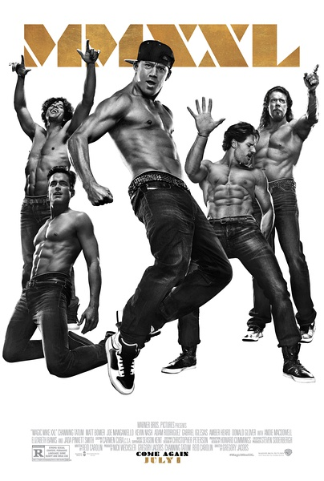
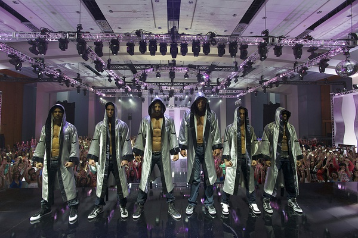

《魔力麦克2 Magic Mike XXL》

			

老公的评论：
 

　　查宁·塔图姆是我们比较喜欢的年轻动作演员，这部电影——是讲跳舞的，需要秀身材，也算是动作片吧——来自岛国爱情动作片的原理。
 

　　这算是一部喜剧，《魔力麦克》两部都算是喜剧，讲脱衣舞男的故事能讲到这么励志，编剧导演们还是挺有一套的，剧中麦克在木工房自己跳的那段舞还真是很好看，另外最后镜子的创意很棒！
 

　　故事里的几位主人公年纪都是35岁左右了，他们的生活也很快乐，我觉得有的时候应该在这方面学习一下那些之前被我们评价太过自由的美国人，洒脱有的时候真的是一种生活方式，或者说，我们应该为我们老了的未来考虑，但是没必要为未来的事情愁苦，毕竟，未来代表的是希望！
 
　　《猫鼠游戏》里的帅哥在这里演了一个很闷的角色，并不出彩，只是看到熟人的感觉很好。
 
　　工作就是工作，工作只是工作——看这部电影的想法！

老婆的评论：
 
　　英雄莫问出处，这应该是查宁的写照吧，谁能想到一个脱衣舞男最后能成为一位巨星呢？
 
　　看的时候，我觉得女人疯狂的时候比男人还疯狂，你看看这些看脱衣舞男的女人们，多疯！
 
　　这部电影的感观不错，一堆的肌肉男，多好的身材。那些舞跳得也不错，很好看。
 

　　让我觉得这个世界上有很多很多的事情，其实我们都不能参与的或者不了解，通过书电影，我们能更多的了解或者感受这个世界，如这些激情的脱衣舞男，真是太酷了。
 

　　至于故事情节一点也不重要，是不是查宁的真实生活，还是加了料的生活，有什么关系呢？让我们都知道，做什么都好好的做，总有一天，你的生活会不同。成功以后谁又在于你的出身？
 
上映年份　2015

多棒的身材！

							
		
http://blog.sina.com.cn/s/blog_52187ba90102w67m.html
