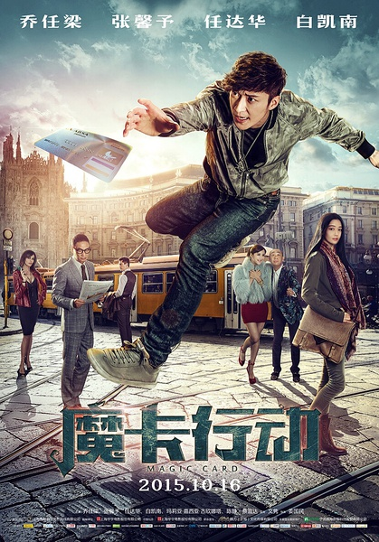
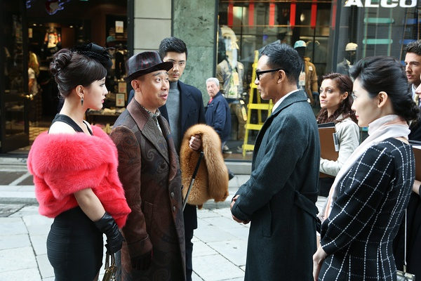

《魔卡行动》

			

老公的评论：

　　我觉得现在大陆演员主演的动作片越来越像老港片，这部《魔卡行动》就是这样：由会讲一点中文的白人演坏人，而这个坏人的手下必须有能打的亚裔形象，最后，一两个厉害的国际刑警破坏了一个巨大的犯罪团伙……

　　每次看华语电影的时候，除了那些描写中国地方风土人情的，我看到的都是两个字——差距。我很奇怪我们的电影为什么总是拍不出好的作品。我觉得看久了华语电影，很难不得出编剧有智商问题的结论。

　　这部电影看着比较舒服的形象是任达华扮演的，真的很佩服他六十岁上下还能够保持这样的身材和状态，要向他看齐……

　　说这部电影的编剧有差距，最大的问题就来自于一个年入五百亿人民币以上的国际犯罪团伙也太过于简单了，我觉得现在大多华语电影的编剧并不是真正的编剧，你让他们写个段子，写幽默的发言稿可能没有问题，但是想把一部电影的逻辑策划圆了，需要下很多电影以外的工夫。我怎么看怎么觉得《魔卡行动》的编剧在犯罪团伙、国际刑警和打斗方面都太幼稚了，对不起，不是幼稚，是太弱智了，这么说我还真怕弱智不高兴！

　　功夫在戏外，编剧的功夫也在戏外，这部电影本身题材有一定的可取性，不过会不会是一个国外的老剧本，被导演拿过来改了改就用了……

　　直到查资料的时候才想起白凯南叫什么，他挺失败的，我也挺失败的……，哈哈！

老婆的评论：

　　使用信用卡有这么多危险？看电影多了，我感觉到处都有陷阱，无时无刻的有阴谋在发生，这个世界多可怕。

　　这部电影，在我看来，是很没有特点的，要说是侦破片，其实很少演如何破案，要说是搞笑片，除了白凯南演的土豪杜豪金说话办事有点搞笑，别的地方也没有搞笑的桥段。当然，如何说是爱情片的话，那么成全了大治（乔任梁饰）和富家千金菲菲（张馨予饰），最后甚至成全了富豪李正华（任达华饰）和一个老外的爱情故事。

　　其实，我最想说的，国内的富豪们真的在国外买街？那太厉害了，也太棒了，一点点把他们和平演变过来，多好！　

　　任达华又来打酱油了，好像现在的华语电影哪里都有他。

上映年份 2015							
		
http://blog.sina.com.cn/s/blog_52187ba90102wnqh.html
