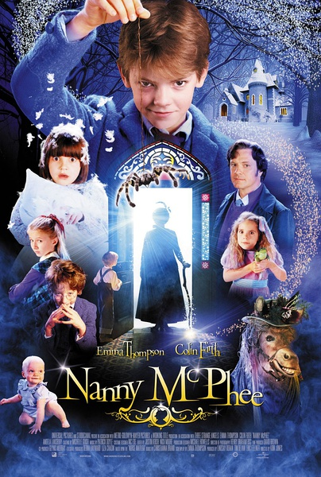
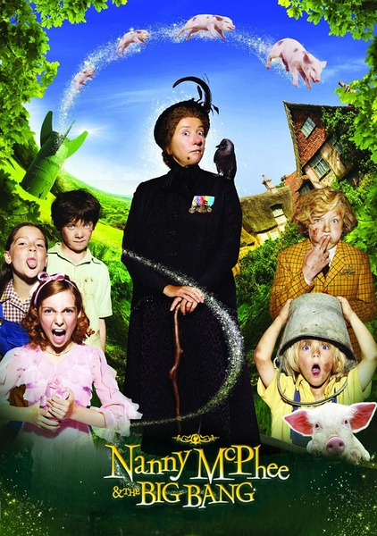

《魔法保姆麦克菲 1&2》

			

老公的评论：

　　这两部电影是为了老婆大人而看的，对于我来说，《魔法保姆麦克菲》明显幼稚了一些，而且从个人角度而言，我并不怎么喜欢励志的文艺作品。
 
　　其实这两部电影给我的感觉是给小朋友看的，只是麦克菲刚刚出现前的样子实在是有些丑，又不大适合给小朋友看，就这样了。
 

　　从这两部电影中，我觉得有趣的地方是比较2010年和2005年电影的变化，很明显，《魔法保姆麦克菲》的第二部加入了跟过的特效，也加入了更多的有关“自然”的元素，这些还算是有趣吧。从特效来说，我更喜欢几只小猪的“水上芭蕾”而不是“愤怒的小鸟”收麦子。
 

　　因为是两部电影连续看的，所以我觉得第二部的最后，让那个老太太用玩具证实一下她就是第一部里最小的小朋友是个很有趣的事情，但是，如果大家都是看的影院播放，时隔五年之后，还能想起来这些细节吗？
 
　　保持我的老观点，这两部电影能够被我们坚持着看完，就是不错的电影，可以解闷，傻笑，你也试试？

老婆的评论：
　　
　　其实这两部电影挺幼稚的。
 

　　你说没事生这么多孩子干嘛？管也管不了吧，养着也费劲吧。我还在猜这个保姆应该是男主人公死去妻子的化身回来帮助他的呢，但不是，这点在我的意料之外了。不过，有点一点我猜对了，那就是男主人公和他们家佣人终将在一起的。额，我还猜到了，第二部的那个健忘老太太应该是第一部里的某一小孩，但没猜到是最小的那个孩子。
 
　　给孩子的五课，第一部和第二部是不同的，大概第一部的小朋友更小点吧，而第二部的魔法和特效比第一部要多些。
 
　　是不是很多家庭都需要这么一个魔法保姆呢？我想教育孩子是一个很复杂的学问，都会期待这么一个魔法保姆的出现吧！
 
上映年份
第一部 2005
第二部 2010							
		
http://blog.sina.com.cn/s/blog_52187ba90101cfge.html
