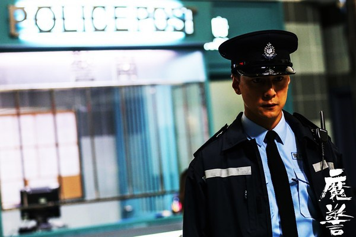
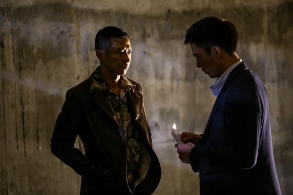

《魔警》

			

老公的评论：

　　吴彦祖在片子里的大多数时候扮相还是挺帅的。

　　难道只有“王伟业”这个有精神问题的警察才能找到“坏人”吗？难道香港市民的安全凭借正常的警察就保护不了吗？这部片子的情节和节奏都还不错，但是立意很怪诞。

　　片子中的几位主演除了吴彦祖，像张家辉、廖启智、李国麟、欧锦棠都是我们很熟悉的TVB演员，他们的演技自然是不用说了，而且，在影视作品中看到啥熟悉的面孔总是会觉得亲切不少。

　　在片子的开始，还以为安志杰会演一次好人了，结果发现他还是没法拜托“帅哥坏蛋”的“宿命　　”。梁焯满算是有好久不见了，我对他的印象还停留在《古惑仔》，听说他后来去拍三级片了，当演员也不容易……

　　说起来片子中的小男孩儿敢在10岁时纵火烧人，也算是狠角色了。

　　对我们来说，看这部电影还是看“熟人”的感觉更多一些，剧情方面，没觉得有什么好看。

老婆的评论：

　　说到底，讲的就是一个有精神问题警察的故事。场面有点黑暗，情节有点压抑，还有点难懂，对于韩江那个角色，我可是和老公请教了好久，才明白过来的。

　　王伟业（吴彦祖饰）是急诊室里的当值警员，无意中救了鬼头党的韩江（张家辉饰），而韩江又像当年他杀死的警员，这个人刺激他的记忆，也把他压抑情绪都激发出来了。在一边自责中，一边要伸张正义里煎熬着。

　　王伟业他开始跟踪调查鬼头党，他听从了韩江的建议，从内部瓦解鬼头党，开始一系列的挑拨鬼头们的关系，很成功。很遗憾，他最后死了，在发现内鬼和解决鬼头党他还是有功劳的。

　　叛徒在什么时候都显得很讨厌，尤其是为了钱，安志杰又在此处演那么一个坏警员，看来他的戏路很难改了。

　　心理疾病很可怕，尤其是那些在特殊岗位上的人群，更应该关心心理问题，因为他们的杀伤力破坏力很强。

　　这部电影还让我觉得亲切，因为很多演员在TVB的电视剧里老能看到。

上映年份 2014							
		
http://blog.sina.com.cn/s/blog_52187ba90102vtak.html
